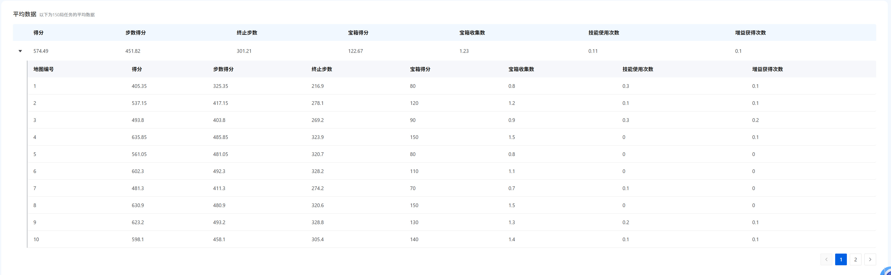

# 项目简介

本项目是 2026 腾讯开悟智能体决策赛道初赛赛题的算法方案。

本团队的方案最终得分为 `574.49`，已在初赛阶段淘汰。

本项目将本地视野与全局视野分别卷积后融合，再与标量特征一起作为 Mamba 模型的输入，最后根据 Mamba 模型的输出进行动作选择和价值估计。模型使用 PPO 算法迭代训练。

最终模型训练了大约 `10,000` 步。

---

# 一点点想法

PPO 本身并非不能训练长序列模型，但朴素 PPO 实现与长序列模型在训练机制上存在一定张力。

PPO 这类近在线算法更强调数据来自较新的策略分布，优势估计通常也依赖有限长度的轨迹；而长时序模型依赖长时间信用分配、跨时间步一致性，以及隐藏状态的一致性。

具体来说，朴素实现中可能会遇到这些问题：

- mini-batch 将序列切碎打乱，破坏连续时间结构；
- TBPTT 会截断时间反向传播；
- $\lambda$ 衰减会让长期优势信号快速变弱，例如 $0.9^{100} \approx 2 \times 10^{-5}$；
- PPO clip 可能让长序列中不同时间步的梯度被不均匀截断；
- rollout 时旧策略采样到的隐藏状态，可能与当前更新中的策略不匹配。

这些问题会增加训练难度，也可能表现为频繁撞 clip 墙。也许我们应该更多参考 [OpenAI Five](https://cdn.openai.com/dota-2.pdf) 这类长时序强化学习系统的工程设计。

训练基础设施也是一个短板。如果能分出一点人日搭建自己的检验平台，而不是全部依赖官方平台，我们应该能更早发现改进点和问题。

可以参考：[hok_chase_opensource](https://github.com/ziwenhahaha/hok_chase_opensource)。

---

# 项目路由

## 代码入口

- `code/agent_ppo/`：当前主算法实现，包含 Agent、PPO 算法、Mamba 模型、特征预处理和训练 workflow。
- `code/agent_ppo/model/model.py`：策略网络与价值网络主体，负责把局部视野、全局视野、标量特征和隐藏状态融合后输出动作 logits 与 value。
- `code/agent_ppo/feature/preprocessor.py`：观测构造、全局记忆、奖励计算和训练样本相关逻辑。
- `code/agent_ppo/algorithm/algorithm.py`：PPO loss、GAE、序列 unroll、优化器更新等训练逻辑。
- `code/agent_ppo/workflow/train_workflow.py`：与环境交互、样本组织、训练指标上报的主流程。

## 配置入口

- `code/agent_ppo/conf/conf.py`：算法侧超参数、奖励系数、模型结构常量和动作先验配置。
- `code/agent_ppo/conf/train_env_conf.toml`：训练环境配置。
- `code/conf/configure_app.toml`：框架运行配置，包括 replay buffer、batch、模型保存和预加载设置。
- `code/conf/algo_conf_gorge_chase.toml`：算法名称到 Agent/workflow 的路由配置。

## 文档入口

- `doc/ppo/README.md`：当前 PPO + Mamba 方案总览。
- `doc/ppo/02_observation_and_memory.md`：观测结构、局部/全局视野、标量特征和隐藏状态说明。
- `doc/ppo/03_model_and_hidden_state.md`：模型结构、Mamba hidden state、TBPTT 序列训练说明。
- `doc/ppo/04_reward_training_aux_loss.md`：奖励、辅助损失和 SampleData 结构说明。
- `doc/ppo/07_config_snapshot.md`：当前关键配置快照。

## 训练与复盘入口

- `train_doc/`：训练截图、阶段报告和复盘记录。
- `monitor/`：训练日志到 TensorBoard/指标的辅助工具。
- `train_monitor/`：离线训练日志分析工具。
- `Result.png`：最终结果截图。

## 发布入口

- `scripts/build_release.py`：跨平台发布包构建脚本。
- `scripts/build_release.ps1`：PowerShell 发布包构建脚本。
- `scripts/BUILD_RELEASE_README.md`：发布包内容和使用说明。

默认发布包只包含容器运行需要的 `code/conf`、`code/agent_ppo` 和 `code/train_test.py` 等内容，并排除缓存、日志、TensorBoard 输出和 checkpoint。需要带预训练模型时，应显式使用 checkpoint 打包开关。

---

# License

This project is licensed under the Apache License 2.0. See [LICENSE](LICENSE) for details.

  

