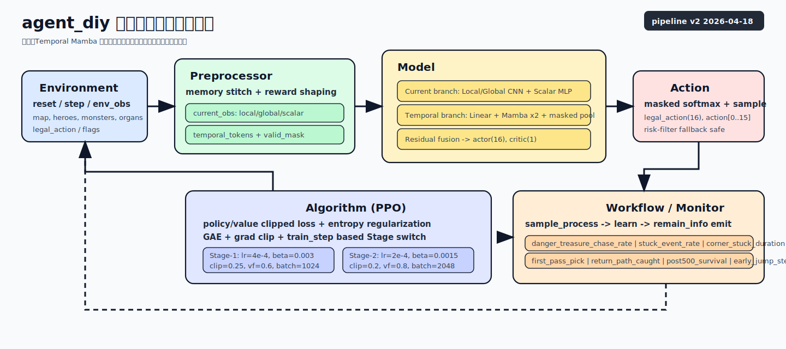
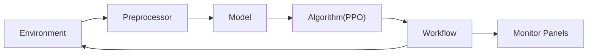
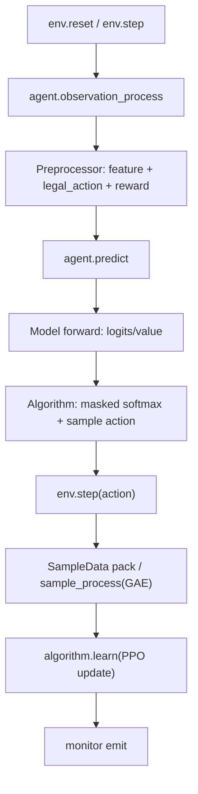
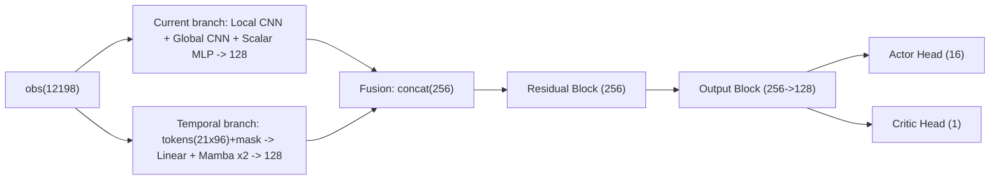
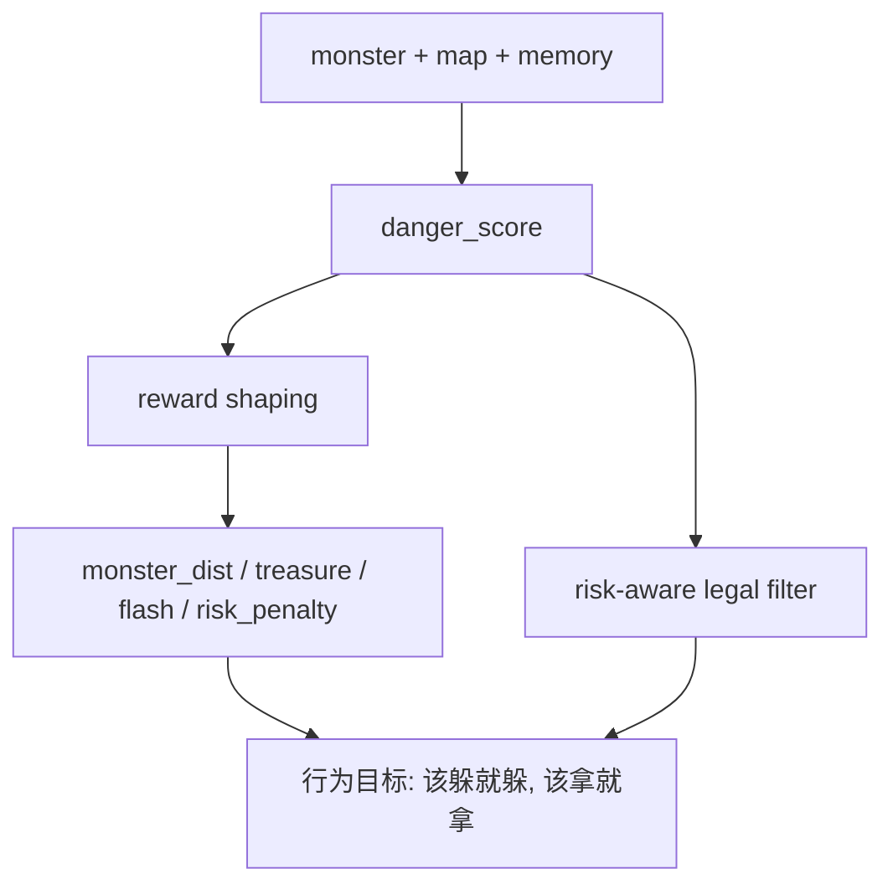

# 01 架构总览（中文版）

本页给出 `agent_diy` 的端到端训练闭环、模块边界与关键数据契约。  
指标和符号说明见：`08_legend_quick_ref.md`。

## 1. 一图看完整链路

## 2. 训练闭环（Step 级）

## 3. 模块职责

| 模块 | 主要职责 | 代码位置 |
|---|---|---|
| 预处理器 | 记忆维护、特征构造、奖励分解、合法动作掩码 | `code/agent_diy/feature/preprocessor.py` |
| 模型 | 当前帧分支 + 时序分支 + 融合，输出策略与价值 | `code/agent_diy/model/model.py` |
| 算法 | PPO 损失、clip、entropy、两阶段超参切换 | `code/agent_diy/algorithm/algorithm.py` |
| 工作流 | 采样循环、样本组装、监控上报 | `code/agent_diy/workflow/train_workflow.py` |
| 配置 | 观测维度、时序开关、训练超参、监控面板 | `code/agent_diy/conf/conf.py` / `code/agent_diy/conf/monitor_builder.py` |

## 4. 数据契约（当前实现）

### 4.1 观测向量

- `obs_total = 12198`
- `current_obs = 10161`
- `temporal_tokens = 21 * 96 = 2016`
- `temporal_valid_mask = 21`

详情见：`02_observation_and_memory.md`、`07_temporal_mamba.md`。

### 4.2 动作空间（16 维）

| 动作编号 | 类型 | 方向 |
|---|---|---|
| 0-7 | 移动 | 8 邻域方向 |
| 8-15 | 闪现 | 8 邻域方向 |

说明：
- 模型输出 `logits(16)`。
- 算法按 `legal_action(16)` 做 masked softmax，避免非法动作。

### 4.3 样本与训练

- `SampleData.obs` 使用扁平向量，不改变框架采样协议 `sequence_length=1`。
- 时序信息通过“单步内拼接滑窗特征”实现，不依赖框架 RNN 序列采样。

## 5. 模型结构（当前版）

结构设计目标：
- 当前帧分支负责“空间瞬时决策”。
- 时序分支负责“追逐趋势、回头风险、500 步后生存压力”。
- 残差融合保证时序信息注入后训练稳定。
- actor 与 critic 均直接基于融合特征输出，不再包含额外的 flash 晚融合分支。

代码级结构拆解见：`09_model_py_structure.md`（逐层对齐 `code/agent_diy/model/model.py`）。

## 6. 奖励与行为约束（架构层视角）

补充说明：
- `danger_score` 不是单一距离阈值，而是由距离、地形卷积信号、风险图融合得到。
- 在危险低时，宝箱奖励基本不受抑制；在危险高时，奖励和动作都会被收敛到“先保命”。

参数和公式细节见：`03_reward_and_training.md`。

## 7. 监控与验收挂钩

关键行为指标：
- `danger_treasure_chase_rate`
- `stuck_event_rate`
- `corner_stuck_duration`
- `first_pass_treasure_pick_rate`
- `return_path_caught_rate`
- `post500_survival_rate`
- `early_jump_step`

面板定义：`code/agent_diy/conf/monitor_builder.py`  
验收流程：`04_ops_checklist.md`、`06_retrain_playbook.md`

## 8. 阅读建议

1. 先读本页 + `02_observation_and_memory.md`，确认输入/输出契约。
2. 再读 `07_temporal_mamba.md`，理解时序分支与开关。
3. 然后读 `09_model_py_structure.md`，对齐 `model.py` 的真实 forward 结构与维度流。
4. 最后读 `03_reward_and_training.md` 与 `04_ops_checklist.md`，对齐训练和验收口径。
