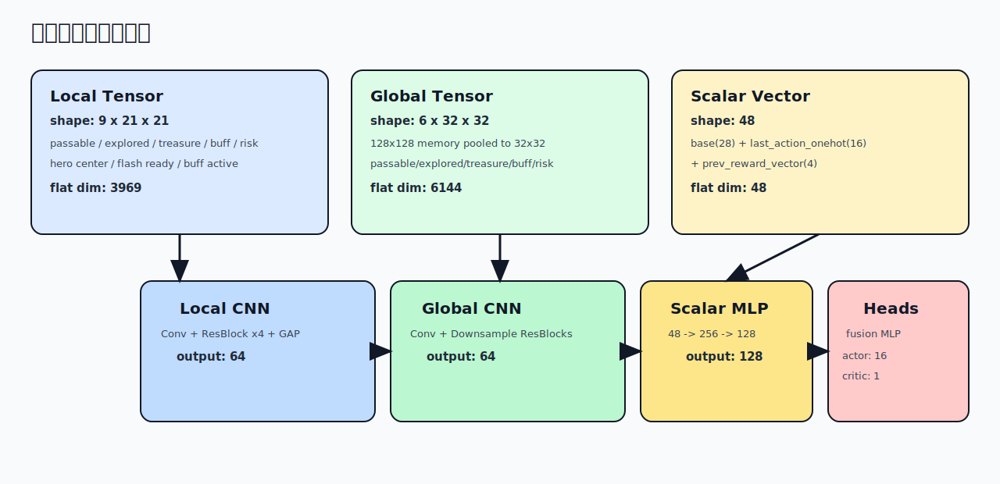
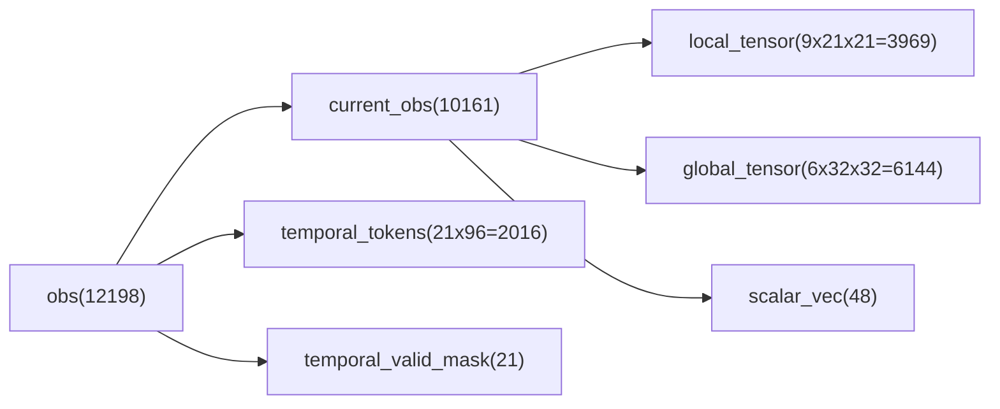
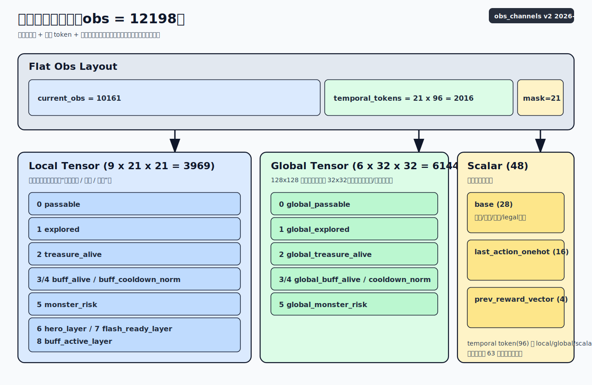
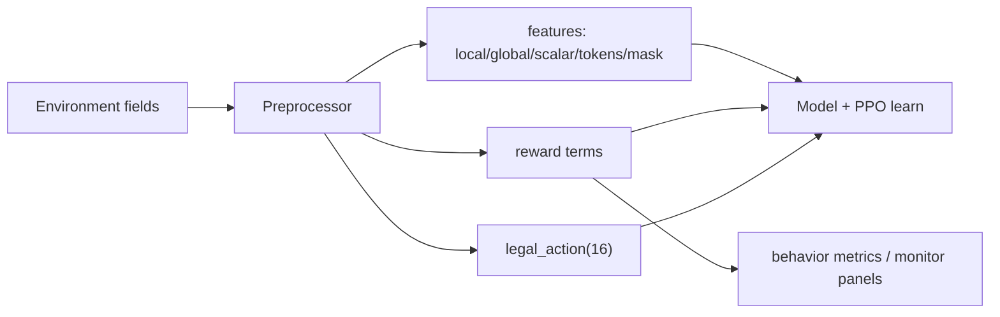
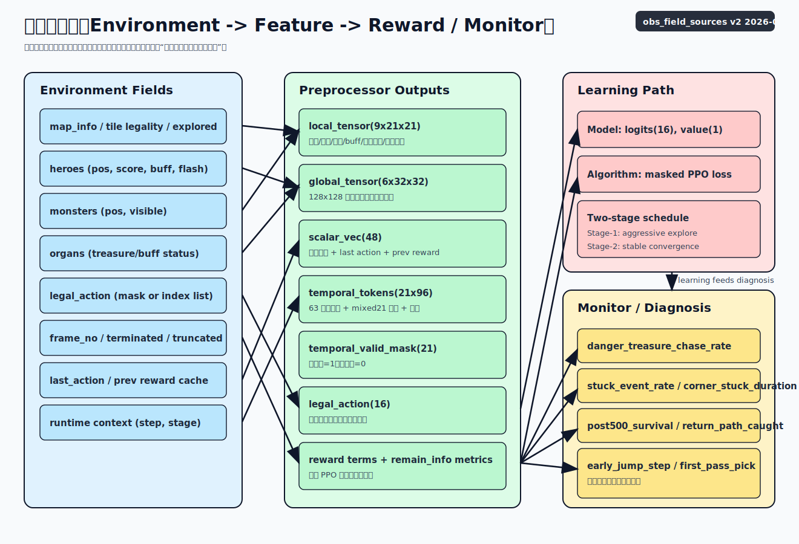

# 02 观测与记忆

读图提示：
- 上图先看 `obs` 扁平布局，再看三大块 `local/global/scalar` 的通道归属。
- 颜色仅用于分组识别，通道语义以本页表格为准。

## 1. 观测切分

`obs` 在样本管线中保持扁平向量，模型内部再反切分：

- `current_obs`:
  - `local_tensor`: `9 x 21 x 21 = 3969`
  - `global_tensor`: `6 x 32 x 32 = 6144`
  - `scalar_vec`: `48`
  - `current_obs_total = 10161`
- `temporal_tokens`: `21 x 96 = 2016`
- `temporal_valid_mask`: `21`
- 总计：`10161 + 2016 + 21 = 12198`

## 1.1 字段来源图

读图提示：
- 左列是环境原始字段，中列是预处理输出，右列是训练与监控消费端。
- 排查问题时可按“字段 -> 特征 -> 指标”链路逆向定位。

## 2. Local 通道（9）

| 通道 | 字段 | 含义 |
|---|---|--|
| 0 | `passable`  | 局部可通行图 |
| 1 | `explored`  | 局部已探索掩码 |
| 2 | `treasure_alive`  | 局部宝箱存活 |
| 3 | `buff_alive`  | 局部 buff 存活 |
| 4 | `buff_cooldown_norm`  | 局部 buff 刷新进度 |
| 5 | `monster_risk`  | 局部怪物风险热力 |
| 6 | `hero_layer`  | 英雄中心 one-hot |
| 7 | `flash_ready_layer`  | 闪现是否就绪 |
| 8 | `buff_active_layer`  | 英雄 buff 持续时间归一化 |

## 3. Global 通道（6）

全局记忆图先维护为 `128x128`，再均值池化到 `32x32`：

| 通道 | 含义 |
|---|---|
| 0 | `global_passable` |
| 1 | `global_explored` |
| 2 | `global_treasure_alive` |
| 3 | `global_buff_alive` |
| 4 | `global_buff_cooldown_norm` |
| 5 | `global_monster_risk` |

## 4. 标量向量（48）

`scalar_vec` 由三部分组成：

- 基础统计 `base(28)`：坐标、分数、剩余进度、怪物风险、legal 比例等
- `last_action_onehot(16)`
- `prev_reward_vector(4)`：上一帧奖励分解缓存

若长度不足则补 0，超长则截断到 `48`。

其中与闪现决策直接相关的标量字段包括：
- `flash_cd_norm`
- `legal_flash_ratio`
- `any_flash_legal`

这些字段作为通用 scalar 状态输入模型，通过 `scalar_mlp` 参与策略学习。

## 5. 记忆更新机制

### 5.1 地图 stitch

- 每步把 `map_info(21x21)` 以英雄绝对坐标贴到 `128x128` 全局图。
- `global_explored` 新开格子用于探索奖励增量。
- `global_passable` 更新为当前观测到的可通行状态。

### 5.2 动态层更新

- 怪物：将可见怪物位置扩散为风险场，并按 `MONSTER_RISK_DECAY` 衰减。
- 宝箱：根据 `organs(sub_type=1,status)` 更新 alive（已拾取视为从地图消失）。
- buff：根据 `organs(sub_type=2,status)` 与刷新逻辑更新 alive/cooldown。

### 5.3 legal_action 解析策略

兼容以下输入形态：

- `bool[16]` 或 `0/1` 数组（按掩码解析）
- 可行动作索引列表（按索引集合解析）

如果解析后全 0，则回退为全 1，防止 softmax 出现空动作集。

### 5.4 Temporal 滑窗记忆

- 维护 `63` 长度历史环形缓冲（每步一个 `compressed_obs_token(96)`）。
- `mixed21` 抽帧偏移（旧到新）：
  - `[62,56,50,44,38,32,26,23,20,17,14,11,8,7,6,5,4,3,2,1,0]`
- 当历史不足时，左侧用最早可用 token 补齐，同时 `temporal_valid_mask` 对应位置记为 `0`。

## 6. 边界与健壮性

- 英雄在地图边角时，局部裁剪自动越界补 0。
- `heroes/monsters/organs` 兼容 `list` 与 `dict` 形态。
- 缺失字段走安全默认值，不因空字段崩溃。

## 7. 图例与速查

- 统一图例与指标方向：`08_legend_quick_ref.md`
- 时序分支结构：`07_temporal_mamba.md`
