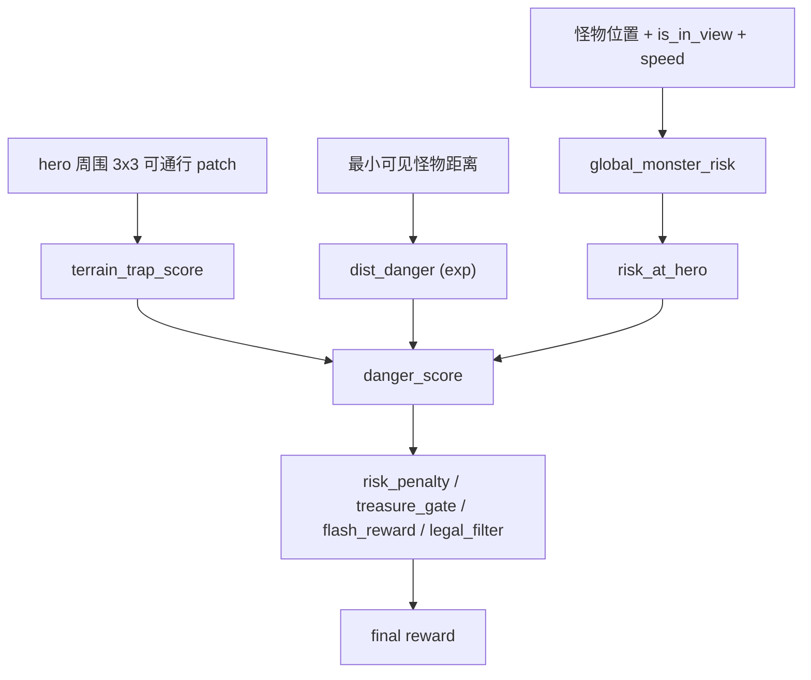
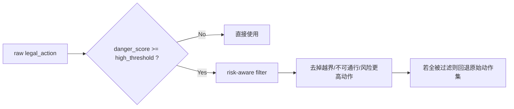
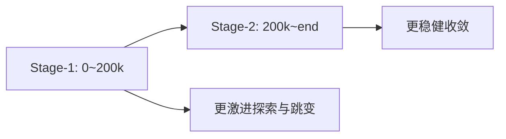

# 03 奖励与训练（Reward and Training）

本页聚焦当前 `agent_diy` 的 reward shaping 设计，重点解释：
- 为什么改成 `danger_score` 连续危险函数；
- 危险函数如何融合距离、地形和风险图；
- 奖励/动作过滤如何共用同一危险信号。

## 1. 一眼看懂：现在的奖励链路



核心变化：
1. 不再用“固定阈值 + 固定 0.15 宝箱衰减”作为主逻辑。
2. 改为连续危险分数 `danger_score in [0,1]`，越危险惩罚越强。
3. 当怪物不够近时，危险分数几乎为 0，不会无端压制捡宝箱。

## 2. 危险函数 `danger_score`

代码位置：`code/agent_diy/feature/preprocessor.py`

### 2.1 距离触发 + 指数曲线

设：
- `d = cur_min_dist_norm`
- `t = MONSTER_DANGER_TRIGGER_DIST_NORM`
- `k = MONSTER_DANGER_EXP_K`

当 `d >= t` 时：
- `danger_score = 0`（距离不近，不施加强压）

当 `d < t` 时：
- `closeness = (t - d) / t`
- `dist_danger = (exp(k * closeness) - 1) / (exp(k) - 1)`

直觉：
- 远处基本不惩罚；
- 接近触发距离后快速抬升；
- 很近时接近 1。

### 2.2 地形卷积信号（可解释、固定构造）

`_terrain_trap_score` 对 hero 周围 `3x3` 的 `global_passable` 做固定核加权：

```text
kernel =
1 2 1
2 4 2
1 2 1
```

同时结合邻域开阔度，得到 `terrain_trap in [0,1]`：
- 开阔地：`terrain_trap` 低；
- 走廊/角落：`terrain_trap` 高。

然后用：
- `terrain_gain = 1 + MONSTER_DANGER_TERRAIN_COEF * terrain_trap`

让相同怪物距离在“险地”上更危险。

### 2.3 与风险图融合

从 `global_monster_risk` 取 hero 位置的 `risk_at_hero`，再做混合：

```text
mixed_base = (1 - MONSTER_DANGER_RISK_BLEND) * dist_danger
             + MONSTER_DANGER_RISK_BLEND * risk_at_hero

danger_score = clip(mixed_base * terrain_gain, 0, 1)
```

高风险判定统一为：
- `danger_score >= MONSTER_DANGER_HIGH_THRESHOLD`

## 3. 奖励如何使用 `danger_score`

### 3.1 怪物距离奖励（只在危险期强调）

```text
dist_delta = cur_min_dist_norm - last_min_monster_dist_norm
danger_for_dist = max(danger_score, last_danger_score)
monster_dist_reward = REWARD_MONSTER_DIST * danger_for_dist * dist_delta
```

解释：
- 危险低时，`danger_for_dist` 小，距离项影响小；
- 危险高时，拉开怪物距离会被明显鼓励。

### 3.2 宝箱奖励连续门控（防“完全不捡宝箱”）

```text
treasure_reward = REWARD_TREASURE_GAIN * delta_treasure
treasure_scale = 1 - danger_score * (1 - DANGER_TREASURE_MIN_REWARD_SCALE)
treasure_reward *= clip(treasure_scale, DANGER_TREASURE_MIN_REWARD_SCALE, 1)
```

这意味着：
- 安全时：几乎不衰减；
- 危险时：衰减，但至少保留 `DANGER_TREASURE_MIN_REWARD_SCALE`（默认 `0.55`）。

### 3.3 风险惩罚与“持续变坏”惩罚

```text
risk_penalty = -(RISK_PENALTY_COEF * danger_score)
               -(RISK_WORSE_PENALTY_UNIT * risk_worse_streak * danger_score)
```

- `risk_worse_streak` 在高风险且持续贴近怪物时累积；
- 不再用老版本的固定 `risk_at_hero` 线性惩罚。

### 3.4 闪现奖励改为危险态判定

仅当 `last_action >= 8`（使用闪现）时评估：
- 如果“处于危险态且闪现后距离改善”，给 `REWARD_FLASH_GOOD`；
- 否则给 `REWARD_FLASH_BAD`。

## 4. 动作过滤也共用危险函数

`_build_legal_action` 中：
1. 先得到环境原始 `legal_action`。
2. 计算 `danger_score`，若未到高风险阈值，直接返回。
3. 高风险时进入 `_apply_risk_aware_filter`，剔除以下动作：
   - 越界；
   - 落到不可通行格；
   - 目标格风险 `target_risk > risk_at_hero + RISK_FILTER_DELTA`。



## 5. `is_in_view` 在奖励中的作用

`_update_monster_risk` 对每个 monster：
- 读取 `is_in_view = float(m.get("is_in_view", 1))`。
- 只有 `is_in_view > 0` 的怪物参与 `cur_min_dist_norm` 最小值统计。
- 若本步没有可见怪物，回退为 `last_min_monster_dist_norm`，避免距离信号断崖抖动。

同时，无论是否可见，都会把怪物位置刷入 `global_monster_risk`（带衰减记忆）。

## 6. 配置项速查（与当前代码一致）

文件：`code/agent_diy/conf/conf.py`

### 6.1 危险函数

| 配置 | 默认值 | 说明 |
|---|---|---|
| `MONSTER_DANGER_TRIGGER_DIST_NORM` | `0.24` | 距离触发阈值 |
| `MONSTER_DANGER_EXP_K` | `5.0` | 指数曲线陡峭度 |
| `MONSTER_DANGER_TERRAIN_COEF` | `0.65` | 地形放大系数 |
| `MONSTER_DANGER_RISK_BLEND` | `0.25` | 距离危险与风险图融合权重 |
| `MONSTER_DANGER_HIGH_THRESHOLD` | `0.45` | 高风险判定阈值 |

### 6.2 奖励与约束

| 配置 | 默认值 | 说明 |
|---|---|---|
| `REWARD_MONSTER_DIST` | `0.35` | 怪物距离塑形主系数 |
| `DANGER_TREASURE_MIN_REWARD_SCALE` | `0.55` | 危险态宝箱最低保留比例 |
| `RISK_PENALTY_COEF` | `0.20` | 基础危险惩罚 |
| `RISK_WORSE_PENALTY_UNIT` | `0.05` | 连续变坏惩罚增量 |
| `RISK_FILTER_DELTA` | `0.08` | 动作过滤容忍边界 |
| `MAX_MONSTER_SPEED` | `2.0` | 怪物速度归一化上限 |

补充：
- `DANGER_TREASURE_REWARD_SCALE` 仍在配置中，但当前主逻辑使用 `DANGER_TREASURE_MIN_REWARD_SCALE` 连续门控。

## 7. PPO 训练配置（两阶段）

实现：`code/agent_diy/algorithm/algorithm.py`

- Stage-1（`train_step < 200000`）：
  - `lr=4e-4`，`beta=0.003`，`vf_coef=0.6`，`clip=0.25`，`grad_clip=0.7`，`batch=1024`
- Stage-2（`train_step >= 200000`）：
  - `lr=2e-4`，`beta=0.0015`，`vf_coef=0.8`，`clip=0.2`，`grad_clip=0.5`，`batch=2048`



## 8. 验收重点指标

- `danger_treasure_chase_rate`
- `stuck_event_rate`
- `corner_stuck_duration`
- `first_pass_treasure_pick_rate`
- `return_path_caught_rate`
- `post500_survival_rate`
- `early_jump_step`

建议和 `04_ops_checklist.md` 一起使用，先看行为指标，再看 loss 曲线。
