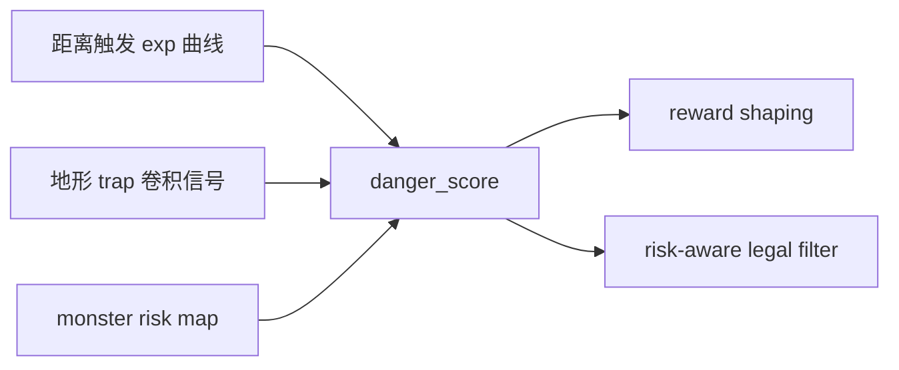

# 06 重训练手册（Retrain Playbook）

目标：解决“被怪物压迫导致行为畸形”的问题，同时保持宝箱收益能力。

## 1. 需要修复的行为

1. 危险逼近时仍追宝箱。
2. 角落/狭窄地形反复卡住。
3. 策略跃迁（jump）过晚。
4. 500 步后生存率下降明显。

## 2. 当前方案核心

解释：
1. `danger_score` 低时，不强压宝箱收益。
2. `danger_score` 高时，先保命（风险惩罚和动作过滤变强）。
3. 宝箱奖励有最低保留比例，避免“完全不捡”。

## 3. 训练阶段配置

### Phase A：短验（120k，A/B）

用途：验证危险函数是否改善“保命与收益平衡”。

配置：
1. A：`temporal_enable=false`
2. B：`temporal_enable=true`，`temporal_sampling_mode=mixed21`，`temporal_input_mode=compressed_obs`
3. 超参：
   - `lr=4e-4`
   - `beta=0.003`
   - `vf_coef=0.6`
   - `clip=0.25`
   - `grad_clip=0.7`
   - `batch=1024`

### Phase B：全量重训（1.2M）

1. 前 `200k`：沿用 Phase A 超参（激进跳变期）。
2. 后 `1.0M`：自动切到收敛期：
   - `lr=2e-4`
   - `beta=0.0015`
   - `vf_coef=0.8`
   - `clip=0.2`
   - `grad_clip=0.5`
   - `batch=2048`

## 4. 验收门槛

短验通过：满足 3/5
1. `early_jump_step` 提前 `>= 25%`
2. `post500_survival_rate` 提升 `>= 20pct`
3. `return_path_caught_rate` 下降 `>= 35%`
4. `danger_treasure_chase_rate` 下降 `>= 30%`
5. `reward` 移动均值提升 `>= 10%`

非回归：
1. `stuck_event_rate`、`corner_stuck_duration` 不得劣于基线 `> 5%`

## 5. 调参顺序（建议）

### 5.1 太怂，不拿宝箱

1. 提高 `DANGER_TREASURE_MIN_REWARD_SCALE`（如 `0.55 -> 0.65`）。
2. 降低 `MONSTER_DANGER_EXP_K`（如 `5.0 -> 4.0`）。
3. 降低 `MONSTER_DANGER_TERRAIN_COEF`（如 `0.65 -> 0.45`）。

### 5.2 太贪，顶着怪拿宝箱

1. 提高 `MONSTER_DANGER_EXP_K`（如 `5.0 -> 6.0`）。
2. 提高 `MONSTER_DANGER_TERRAIN_COEF`（如 `0.65 -> 0.8`）。
3. 降低 `MONSTER_DANGER_HIGH_THRESHOLD`（如 `0.45 -> 0.40`）。
4. 适度提高 `RISK_PENALTY_COEF`、`RISK_WORSE_PENALTY_UNIT`。

### 5.3 容易卡角

1. 保持危险函数不变，先观察 `stuck` 与 `pingpong` 惩罚是否生效。
2. 若仍卡死，优先检查 `global_passable` 拼图和动作过滤是否把可行动作全过滤。

## 6. 回滚规则

全量重训前 `150k` 触发任一条件即回滚：
1. `stuck_event_rate` 回升接近基线。
2. `danger_treasure_chase_rate` 明显反弹。
3. `reward` 移动均值连续 3 个窗口下滑。

回滚动作：
1. 保留短验最佳 checkpoint。
2. 下调 Stage-1 学习率 `20%` 后重跑。
3. 按“太怂/太贪”症状只改一组危险参数，不混调。

