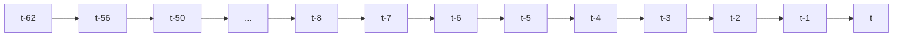
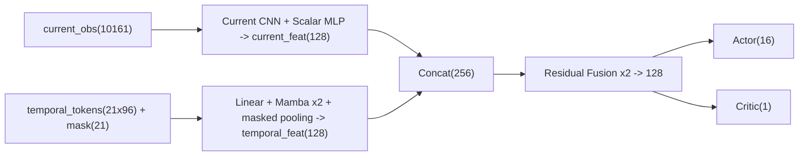

# 07 Temporal Mamba

## 1. Goal

This page documents the `agent_diy` sliding-window temporal upgrade:

1. Keep framework sampling protocol unchanged (`sequence_length=1`).
2. Add temporal modeling to improve long-horizon decisions.
3. Improve post-500-step survival and reduce return-path catch events.

## 2. Temporal Input Design

### 2.1 Window and Sampling

- Ring buffer capacity: `63`
- Sequence length: `21`
- Default sampling mode: `mixed21`
- `mixed21` offsets (oldest to newest):
  - `[62,56,50,44,38,32,26,23,20,17,14,11,8,7,6,5,4,3,2,1,0]`

Sampling legend (not to scale):

Other supported modes:

- `dense21`: contiguous 21 steps
- `stride3x21`: 21 steps with stride=3
- `none`: temporal branch disabled at input side

### 2.2 Token Format

- Token dim: `96`
- Source: compressed observation (`compressed_obs`)
  - local map pooled features
  - global map pooled features
  - scalar base features
- Mask: `temporal_valid_mask(21)` where:
  - valid sampled step -> `1`
  - padded sampled step -> `0`

When history is shorter than required offsets:

- Left side is filled with earliest available token.
- Corresponding mask entries remain `0`.

## 3. Model Structure

Structure view:

1. Current-frame branch (unchanged core):
- Local CNN + Global CNN + Scalar MLP -> `current_feat(128)`

2. Temporal branch:
- `Linear(96 -> 128)`
- `MambaBlock x2` (pure PyTorch implementation)
- masked last-token pooling -> `temporal_feat(128)`

3. Fusion (two-layer residual, final decision):
- `concat(current_feat, temporal_feat) => 256`
- `ResidualFusionBlock(256)`:
  - `LayerNorm -> Linear(256,256) -> SiLU -> Linear(256,256) + skip`
- Output:
  - `LayerNorm -> Linear(256,128) -> SiLU`
- Actor/Critic heads:
  - `actor: 128 -> 16`
  - `critic: 128 -> 1` (unchanged)

Code-aligned full breakdown:
中文翻译：代码级完整拆解见 `09_model_py_structure.md`（含 `_split_obs`、`_encode_temporal` 与 `MambaBlock` 内部数据流）。

## 4. Runtime Switches (A/B)

Defined in `code/agent_diy/conf/conf.py`:

- `TEMPORAL_ENABLE` (`true/false`)
- `TEMPORAL_SAMPLING_MODE` (`none/mixed21/dense21/stride3x21`)
- `TEMPORAL_INPUT_MODE` (`scalar/compressed_obs`)

Recommended A/B short-validation setup:

1. A baseline:
- `TEMPORAL_ENABLE=false`

2. B temporal:
- `TEMPORAL_ENABLE=true`
- `TEMPORAL_SAMPLING_MODE=mixed21`
- `TEMPORAL_INPUT_MODE=compressed_obs`

## 5. Metrics

Temporal-related acceptance metrics:

- `early_jump_step`
- `post500_survival_rate`
- `return_path_caught_rate`
- `first_pass_treasure_pick_rate`

Legacy non-regression metrics:

- `danger_treasure_chase_rate`
- `stuck_event_rate`
- `corner_stuck_duration`

Metric legend and direction reference: `08_legend_quick_ref.md`.
