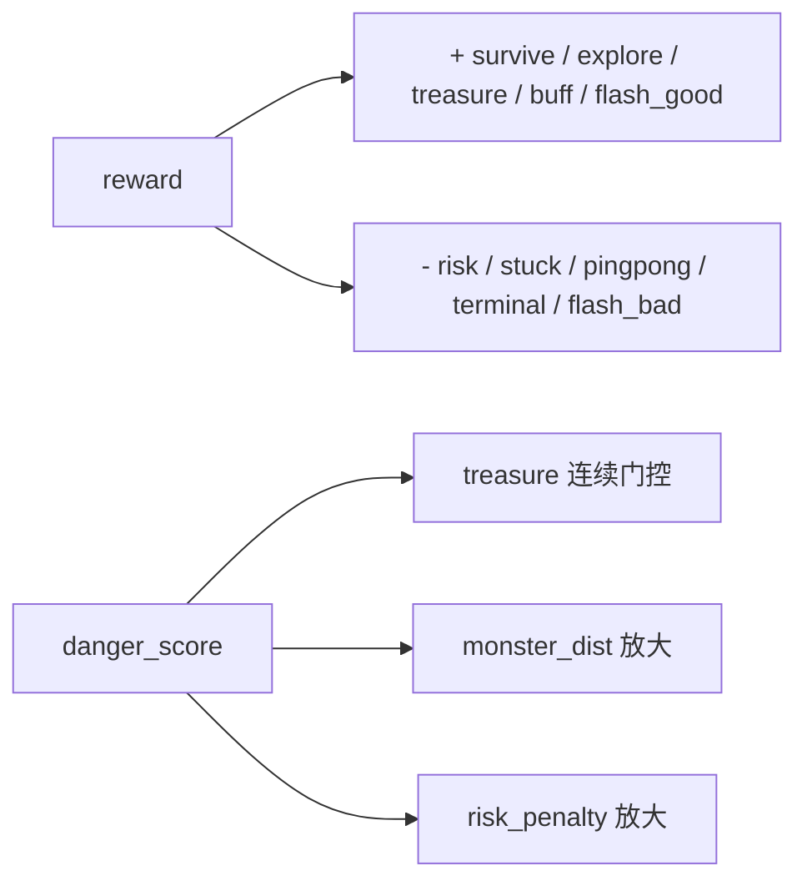

# 08 图例速查（Legend Quick Reference）

用于在 `03/04/06/07` 中快速对照术语、指标和方向。

## 1. 趋势图例

| 图例 | 含义 | 判定 |
|---|---|---|
| `↑` | 越大越好 | 提升代表优化 |
| `↓` | 越小越好 | 下降代表优化 |
| `≈` | 稳定即可 | 波动在可控范围 |
| `!` | 风险信号 | 需要回放+日志复核 |

## 2. 危险函数术语

| 术语 | 含义 |
|---|---|
| `cur_min_dist_norm` | 当前步 hero 到可见怪物的最小归一化距离 |
| `is_in_view` | 怪物可见标记；仅可见怪物参与最小距离统计 |
| `global_monster_risk` | 怪物风险热力图（带衰减记忆） |
| `risk_at_hero` | 风险图在 hero 位置的取值 |
| `terrain_trap_score` | hero 周围地形陷阱分数（3x3 固定卷积 + 邻域开阔度） |
| `dist_danger` | 距离触发后的指数危险分量 |
| `danger_score` | 融合后最终危险分数，范围 `[0,1]` |
| `high_risk` | `danger_score >= MONSTER_DANGER_HIGH_THRESHOLD` |

## 3. 奖励速查

关键点：
1. 宝箱门控是连续函数，不是硬乘 `0.15`。
2. 危险低时，怪物距离塑形和风险惩罚都弱。
3. 危险高时，保命优先级上升。

## 4. 行为指标速查

| 指标 | 目标 | 解释 |
|---|---|---|
| `danger_treasure_chase_rate` | `↓` | 危险态仍接近宝箱的比例 |
| `stuck_event_rate` | `↓` | 卡死事件频率 |
| `corner_stuck_duration` | `↓` | 每次卡死平均持续步数 |
| `first_pass_treasure_pick_rate` | `↑` | 首次路过宝箱即拾取比例 |
| `return_path_caught_rate` | `↓` | 回头拿箱后被抓比例 |
| `post500_survival_rate` | `↑` | 500 步后生存率 |
| `early_jump_step` | `↓` | 策略跃迁步数，越早越好 |

## 5. 训练指标速查

| 指标 | 目标 | 风险信号 |
|---|---|---|
| `reward_ma` | `↑` | 长期不抬升，只有噪声 |
| `value_loss` | `↓` | 长窗口高振荡 |
| `policy_loss` | `≈` | 过早贴近 0 且 reward 不升 |
| `entropy` | `≈` | 突然塌缩（探索不足） |
| `total_loss` | `≈` | 下降后长期异常波动 |

## 6. 排障优先级

1. `! 行为异常`：先看回放（是否贪箱、是否卡角）。
2. `! 指标异常`：看 `danger/stuck/post500` 三组行为指标。
3. `! 训练异常`：最后看 loss 和吞吐。

