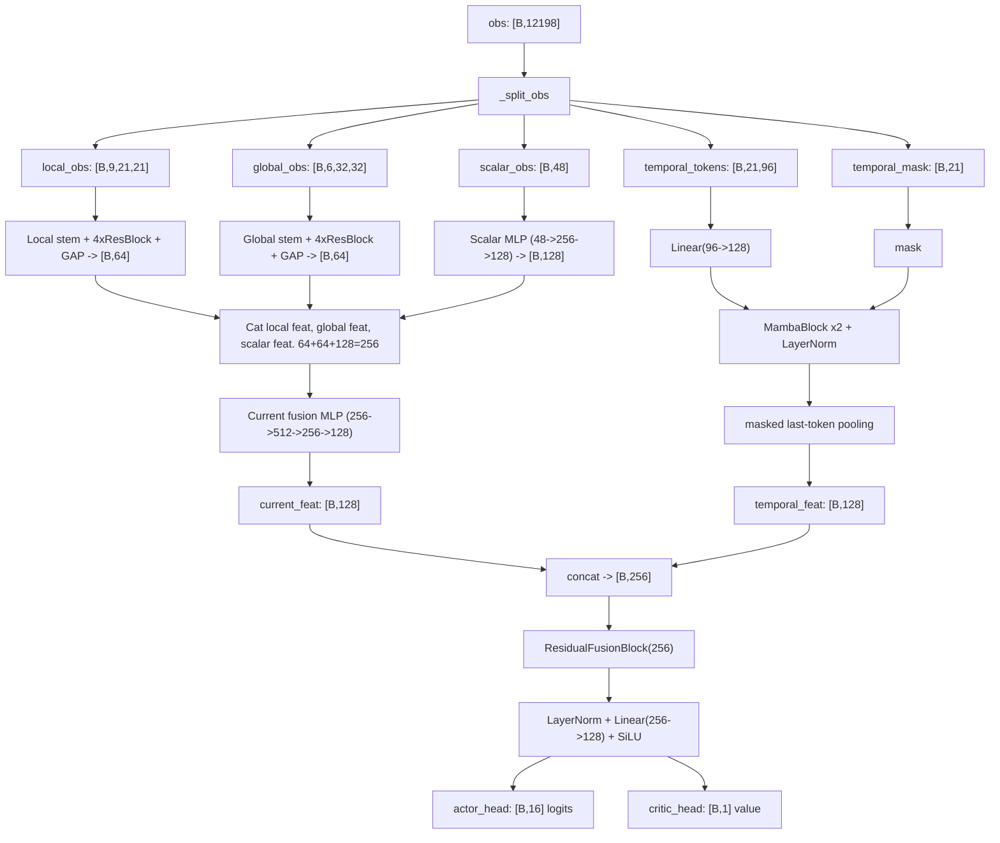
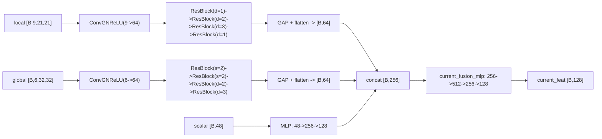
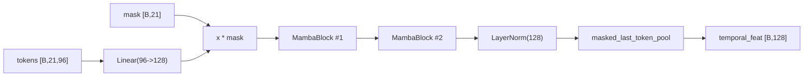
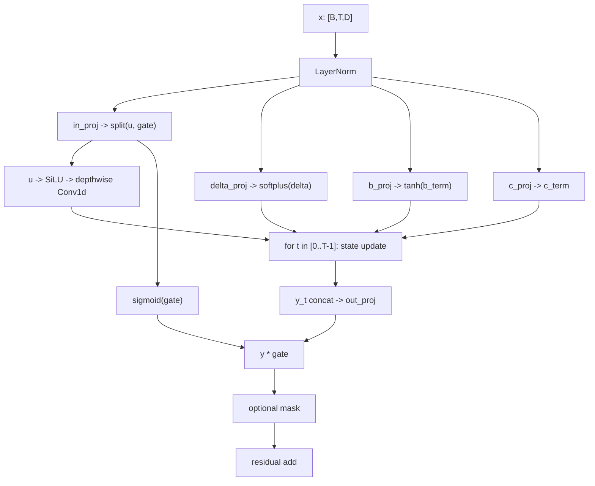

# 09 `model.py` 模型结构拆解（Code-Aligned）

本页严格对齐 `code/agent_diy/model/model.py` 当前实现，目标是让你在 3-5 分钟内回答三个问题：

1. `obs(12198)` 是如何被拆分并送入各分支的？
2. 当前帧分支与时序分支分别做了什么？
3. actor / critic 的最终输出来自哪些中间特征？

## 1. 整体结构（一图总览）

## 2. 输入切分契约（`_split_obs`）

`Config` 对应关系：

| 片段 | 维度 | 计算方式 |
|---|---:|---|
| `base_obs` | `10161` | `FEATURE_LEN` |
| `temporal_flat` | `2016` | `TEMPORAL_SEQ_LEN(21) * TEMPORAL_TOKEN_DIM(96)` |
| `temporal_mask` | `21` | `TEMPORAL_MASK_DIM` |
| 总计 | `12198` | `10161 + 2016 + 21` |

`base_obs` 再拆为：

| 子块 | 形状 | 来源 |
|---|---|---|
| `local` | `[B,9,21,21]` | `LOCAL_CHANNELS`, `LOCAL_MAP_SIZE` |
| `global_map` | `[B,6,32,32]` | `GLOBAL_CHANNELS`, `GLOBAL_MAP_SIZE` |
| `scalar` | `[B,48]` | `SCALAR_DIM` |

## 3. 当前帧分支（空间瞬时决策）

直觉理解：
- `local` 分支更关注近场细节（走位/碰撞风险）。
- `global` 分支更关注远场布局（路径与追逐关系）。
- `scalar` 分支承载非图像状态量（CD、计数、规范化统计量等）。

## 4. 时序分支（Mamba）

`MambaBlock` 内部可视化（简化版）：

关键点：
- 这是纯 PyTorch 的轻量状态空间实现，时间维是显式 `for t` 扫描。
- `mask` 同时作用于输入和 block 输出，避免填充帧污染有效时序表征。
- 池化采用“最后一个有效 token”，对应策略决策最相关的最近历史状态。

## 5. 融合与输出头

融合路径：

1. `fused = concat(current_feat, temporal_feat)` 得到 `[B,256]`
2. 过 `ResidualFusionBlock(256)` 保留主干稳定性
3. 过 `fusion_output: LayerNorm -> Linear(256,128) -> SiLU`
4. 分别进入：
- `actor_head: Linear(128,16)`
- `critic_head: Linear(128,1)`

这意味着 actor 与 critic 共享完整 backbone，并直接基于融合特征分别输出策略与价值。

## 6. 代码锚点（便于对照）

- 初始化与模块装配：`Model.__init__`
- 输入切分：`Model._split_obs`
- 时序编码：`Model._encode_temporal`
- 有效 token 池化：`Model._masked_last_token_pool`
- 主前向：`Model.forward`

源码：`code/agent_diy/model/model.py`
