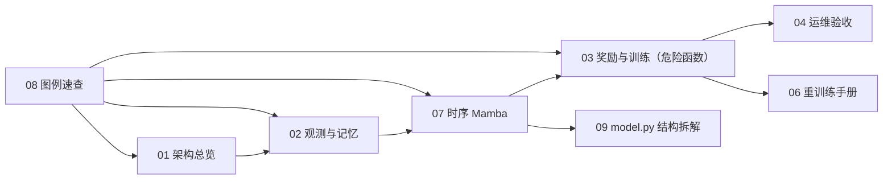

# agent_diy 文档总览

`doc/agent_diy` 是 `agent_diy` 的长期维护文档入口。

## 0. 快速阅读路径

推荐顺序：
1. `01 -> 02 -> 07`，先建立输入和模型心智图。
2. `03`，重点看怪物危险函数和 reward shaping。
3. `04 -> 06`，对应验收和重训。
4. 不确定术语时查 `08`，要和代码逐行对齐时看 `09`。

## 1. 最近更新重点（2026-04）

- 怪物最大速度归一化常量已对齐为 `MAX_MONSTER_SPEED = 2.0`。
- 奖励塑形由“硬门控”改为“危险度连续门控”：
  - 距离触发 + 指数曲线：`exp(closeness)` 风格；
  - 地形卷积信号：`terrain_trap_score`；
  - 融合风险图：`global_monster_risk`；
  - 输出统一 `danger_score`，驱动奖励、动作过滤和闪现判定。
- `flash late fusion` 已从当前 `agent_diy` 实现移除。

## 2. 文档导航

- [00_search_index.md](00_search_index.md): 全局关键词索引（便于 grep/检索）
- [01_architecture.md](01_architecture.md): 端到端链路与模块边界
- [02_observation_and_memory.md](02_observation_and_memory.md): 观测拆分与记忆
- [03_reward_and_training.md](03_reward_and_training.md): 奖励设计、危险函数、PPO 训练
- [04_ops_checklist.md](04_ops_checklist.md): 运行、排障、验收清单
- [05_post_training.md](05_post_training.md): 后训练与 checkpoint 加载
- [06_retrain_playbook.md](06_retrain_playbook.md): 重训练策略与回滚规则
- [07_temporal_mamba.md](07_temporal_mamba.md): 时序分支与开关
- [08_legend_quick_ref.md](08_legend_quick_ref.md): 图例和指标速查
- [09_model_py_structure.md](09_model_py_structure.md): `model.py` 代码级结构对照

## 3. 当前快照

| 项目 | 当前值 |
|---|---|
| 观测维度 | `12198` |
| 观测拆分 | `current=10161`，`temporal_tokens=21x96`，`temporal_mask=21` |
| 动作空间 | `16`（`0-7` 移动，`8-15` 闪现） |
| 模型骨干 | 当前帧 CNN + Temporal Mamba + Residual 融合 |
| 算法 | PPO（legal action masked softmax） |
| 危险函数 | `danger_score = f(距离, 地形, 风险图)` |
| 关键开关 | `temporal_enable` / `temporal_sampling_mode` / `temporal_input_mode` |

## 4. 代码真值源

- `code/agent_diy/conf/conf.py`
- `code/agent_diy/feature/preprocessor.py`
- `code/agent_diy/model/model.py`
- `code/agent_diy/algorithm/algorithm.py`
- `code/agent_diy/workflow/train_workflow.py`
- `code/conf/algo_conf_gorge_chase.toml`
- `code/train_test.py`

## 5. 维护规则

- 配置改动必须同步文档。
- 观测/动作/奖励契约改动必须更新本 README 快照。
- 文档和实现冲突时，以代码为准，并回写文档。

## 6. 检索关键词（常用）

`monster_danger` `danger_score` `terrain_trap` `is_in_view` `risk_penalty` `danger_treasure_chase_rate` `return_path_caught_rate` `post500_survival_rate` `TEMPORAL_ENABLE` `MAX_MONSTER_SPEED`
