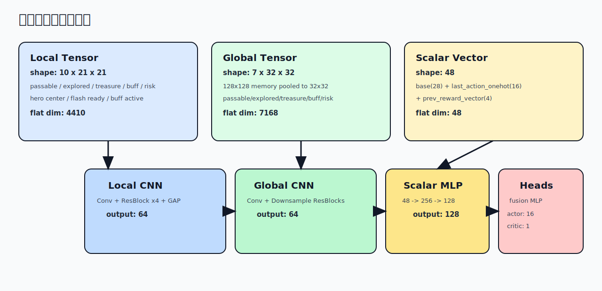

# 02 观测与记忆

## 1. 观测切分

`obs` 在样本管线中保持扁平向量，模型内部再反切分：

- `local_tensor`: `10 x 21 x 21 = 4410`
- `global_tensor`: `7 x 32 x 32 = 7168`
- `scalar_vec`: `48`
- 总计：`4410 + 7168 + 48 = 11626`

## 2. Local 通道（10）

| 通道 | 含义 |  |
|---|---|--|
| 0 | `passable` 局部可通行图 | 1 |
| 1 | `explored` 局部已探索掩码 | 1 |
| 2 | `treasure_alive` 局部宝箱存活 | 1 |
| 3 | `treasure_collected` 局部宝箱已收集 | x |
| 4 | `buff_alive` 局部 buff 存活 | x |
| 5 | `buff_cooldown_norm` 局部 buff 刷新进度 | 1 |
| 6 | `monster_risk` 局部怪物风险热力 | x |
| 7 | `hero_layer` 英雄中心 one-hot | 1 |
| 8 | `flash_ready_layer` 闪现是否就绪 | x |
| 9 | `buff_active_layer` 英雄 buff 持续时间归一化 | x |

## 3. Global 通道（7）

全局记忆图先维护为 `128x128`，再均值池化到 `32x32`：

| 通道 | 含义 |
|---|---|
| 0 | `global_passable` |
| 1 | `global_explored` |
| 2 | `global_treasure_alive` |
| 3 | `global_treasure_collected` |
| 4 | `global_buff_alive` |
| 5 | `global_buff_cooldown_norm` |
| 6 | `global_monster_risk` |

## 4. 标量向量（48）

`scalar_vec` 由三部分组成：

- 基础统计 `base(28)`：坐标、分数、剩余进度、怪物风险、legal 比例等
- `last_action_onehot(16)`
- `prev_reward_vector(4)`：上一帧奖励分解缓存

若长度不足则补 0，超长则截断到 `48`。

## 5. 记忆更新机制

### 5.1 地图 stitch

- 每步把 `map_info(21x21)` 以英雄绝对坐标贴到 `128x128` 全局图。
- `global_explored` 新开格子用于探索奖励增量。
- `global_passable` 更新为当前观测到的可通行状态。

### 5.2 动态层更新

- 怪物：将可见怪物位置扩散为风险场，并按 `MONSTER_RISK_DECAY` 衰减。
- 宝箱：根据 `organs(sub_type=1,status)` 更新 alive/collected。
- buff：根据 `organs(sub_type=2,status)` 与刷新逻辑更新 alive/cooldown。

### 5.3 legal_action 解析策略

兼容以下输入形态：

- `bool[16]` 或 `0/1` 数组（按掩码解析）
- 可行动作索引列表（按索引集合解析）

如果解析后全 0，则回退为全 1，防止 softmax 出现空动作集。

## 6. 边界与健壮性

- 英雄在地图边角时，局部裁剪自动越界补 0。
- `heroes/monsters/organs` 兼容 `list` 与 `dict` 形态。
- 缺失字段走安全默认值，不因空字段崩溃。

