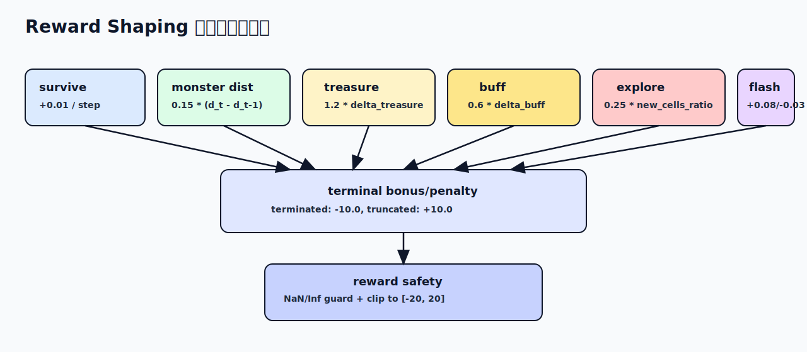

# 03 奖励与训练



## 1. 每步奖励构成

`reward` 由以下分量加和得到：

```text
reward =
  survive_reward
  + monster_distance_shaping
  + treasure_gain_bonus
  + buff_gain_bonus
  + explore_bonus
  + flash_efficiency
  + terminal_reward
```

当前默认系数来自 `conf.py`：

| 分量 | 系数 |
|---|---|
| `REWARD_SURVIVE` | `+0.01` |
| `REWARD_MONSTER_DIST` | `+0.15` * 距离改善量 |
| `REWARD_TREASURE_GAIN` | `+1.2` * 宝箱增量 |
| `REWARD_BUFF_GAIN` | `+0.6` * buff 增量 |
| `REWARD_EXPLORE_GAIN` | `+0.25` * 新探索比例 |
| `REWARD_FLASH_GOOD` | `+0.08` |
| `REWARD_FLASH_BAD` | `-0.03` |
| `REWARD_TERMINATED` | `-10.0` |
| `REWARD_TRUNCATED` | `+10.0` |

## 2. 关键逻辑

- 闪现效率：若上一步使用闪现且处于高风险并成功拉开距离，给正奖，否则轻惩罚。
- 探索奖励：按新探索格子增量计算，并受 `EXPLORE_GAIN_CLIP` 限制。
- 数值防护：`reward` 做 `NaN/Inf` 防护和 `clip([-20, 20])`。

## 3. PPO 损失实现

算法使用 masked policy + clipped value：

1. `prob_dist = masked_softmax(logits, legal_action)`
2. `ratio = new_prob / old_prob`
3. `policy_loss = max(-ratio*adv, -clip(ratio)*adv).mean()`
4. `value_loss = 0.5 * max((tdret-v)^2, (tdret-v_clip)^2).mean()`
5. `entropy_loss = -sum(p * log p).mean()`
6. `total_loss = vf_coef * value_loss + policy_loss - beta * entropy_loss`

其中：

- `clip_param = 0.2`
- `vf_coef = 1.0`
- `beta = 0.001`
- 梯度裁剪 `GRAD_CLIP_RANGE = 0.5`

## 4. GAE 时序后处理

`sample_process` 中倒序计算：

```text
delta_t = -V(s_t) + r_t + gamma * V(s_{t+1})
gae_t   = delta_t + gamma * lambda * gae_{t+1}
```

并写入：

- `advantage = gae`
- `reward_sum = gae + value`

## 5. 训练监控指标

训练循环会周期上报：

- `total_loss`
- `policy_loss`
- `value_loss`
- `entropy_loss`
- `reward`（batch 平均）

