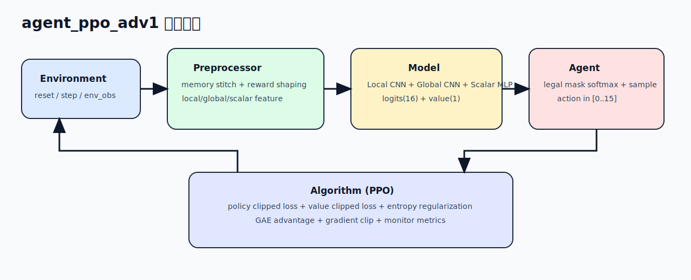

# agent_ppo_adv1 算法文档

本目录用于持久化 `agent_ppo_adv1` 的设计、实现与运维说明，作为后续迭代的单一文档入口。

## 1. 文档导航

- [01_architecture.md](01_architecture.md): 端到端架构、模块职责、动作空间协议
- [02_observation_and_memory.md](02_observation_and_memory.md): 观测切分、全局记忆图、特征构建细节
- [03_reward_and_training.md](03_reward_and_training.md): 奖励分解、PPO 损失、训练监控指标
- [04_ops_checklist.md](04_ops_checklist.md): 配置接入点、容器内烟测清单、常见排障

## 2. 当前实现快照

| 项 | 值 |
|---|---|
| 观测总维度 | `11626` |
| 观测拆分 | `local: 10x21x21`, `global: 7x32x32`, `scalar: 48` |
| 动作空间 | `16`（`0-7`移动，`8-15`闪现） |
| 模型主干 | Local CNN + Global CNN + Scalar MLP 融合 |
| 算法 | PPO（带 legal mask softmax） |
| 奖励 | 生存/怪物距离/宝箱/buff/探索/闪现效率/终局 |

## 3. 代码单一真相源

- `code/agent_ppo_adv1/conf/conf.py`
- `code/agent_ppo_adv1/feature/preprocessor.py`
- `code/agent_ppo_adv1/model/model.py`
- `code/agent_ppo_adv1/algorithm/algorithm.py`
- `code/agent_ppo_adv1/workflow/train_workflow.py`
- `code/conf/algo_conf_gorge_chase.toml`
- `code/train_test.py`

## 4. 文档维护约定

- 配置参数改动，必须同步更新 `02` 或 `03` 中对应表格。
- 观测通道数、动作维度、奖励系数任何变化，必须同步更新本页“当前实现快照”。
- 与环境协议不一致时，以 `doc/md/dev_guide__env.md` 与 `doc/md/dev_guide__protocol.md` 为准并更新说明。

