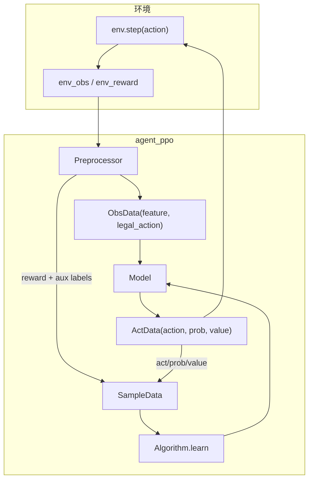
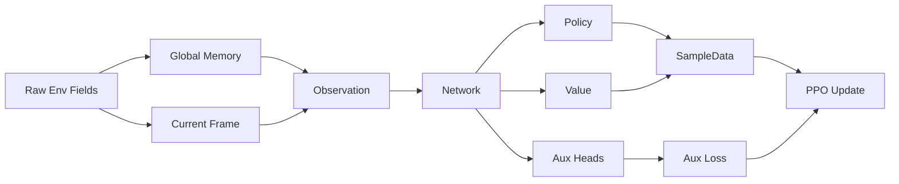
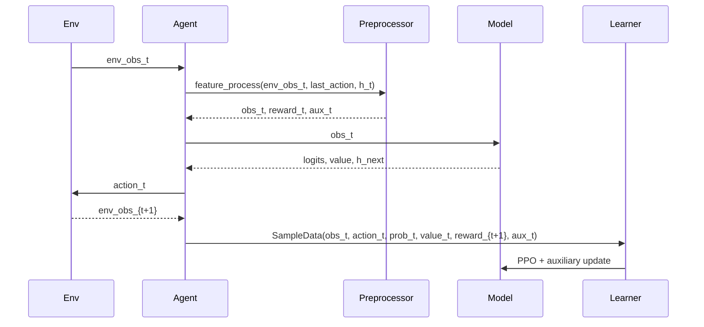

# 01 架构总览

`agent_ppo` 当前目标是：在官方 16 动作空间上，用局部视野、全局记忆、标量状态和真隐状态 Mamba 做 PPO 训练，同时用怪物辅助监督稳定表征。

## 端到端链路

## 模块责任

| 模块 | 文件 | 责任 |
|---|---|---|
| 配置 | `code/agent_ppo/conf/conf.py` | 统一定义 shape、动作数、BFS 阈值、reward/loss 权重 |
| 预处理 | `code/agent_ppo/feature/preprocessor.py` | 维护全局图、构造观测、生成 reward 和辅助标签 |
| 数据定义 | `code/agent_ppo/feature/definition.py` | 定义 `ObsData`、`ActData`、`SampleData` 字段维度 |
| 模型 | `code/agent_ppo/model/model.py` | local/global CNN、scalar MLP、hidden Mamba、任务头 |
| PPO | `code/agent_ppo/algorithm/algorithm.py` | PPO loss、value loss、entropy、怪物辅助 loss |
| 工作流 | `code/agent_ppo/workflow/train_workflow.py` | 与环境交互，拼装样本，回传 learner |

## 数据流分层图

## 一次训练样本的生命周期

## 关键约束

- 观测长度当前为 `9647`，其中 global obs 已从内部 `128x128` 记忆压缩为 `6x32x32`。
- 动作空间必须保持 16 维：`0-7` 移动，`8-15` 闪现。
- hidden state 是显式样本输入的一部分：采样时写入 `obs`，训练样本按非重叠 48 步窗口传输，learner 在窗口内 unroll Mamba。
- 怪物位置辅助 loss 只在可见怪物存在时启用。

## 课程学习状态

课程学习已删除。`EpisodeRunner.run_episodes` 每局都直接使用 `agent_ppo/conf/train_env_conf.toml` 的正式环境参数：

- `monster_interval = 300`
- `monster_speedup = 500`
- `max_step = 1000`

代码中不再有 `copy.deepcopy(self.usr_conf)` 或基于 `episode_cnt` 的难度覆盖。
