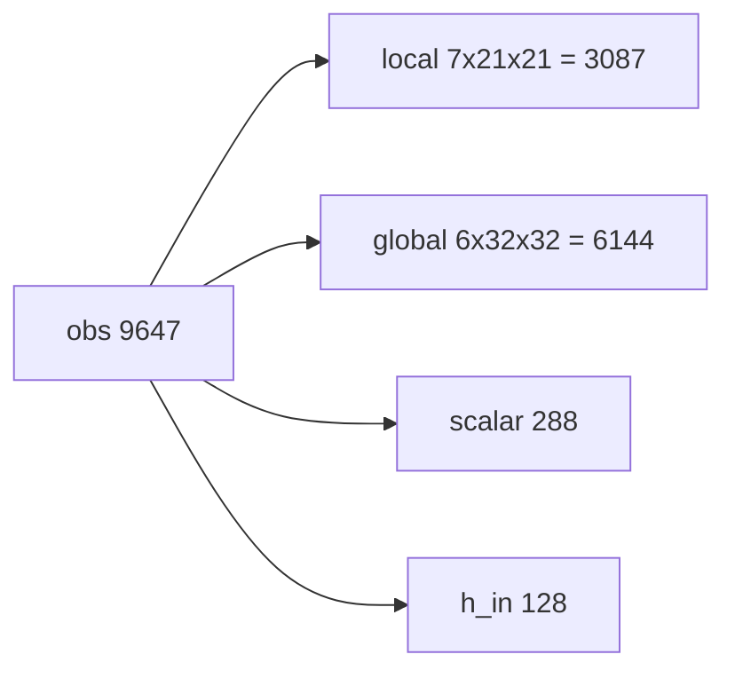
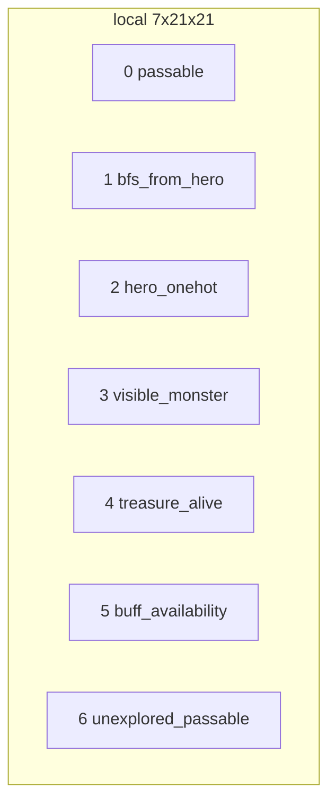
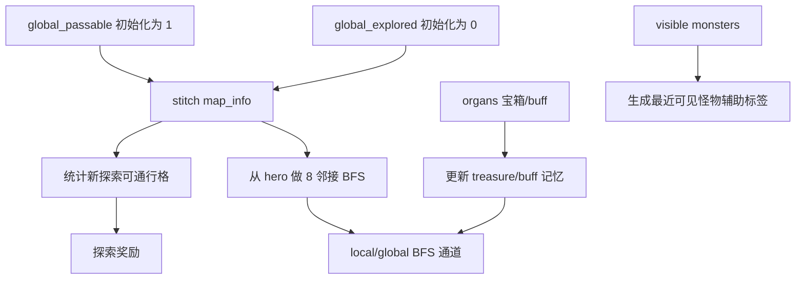
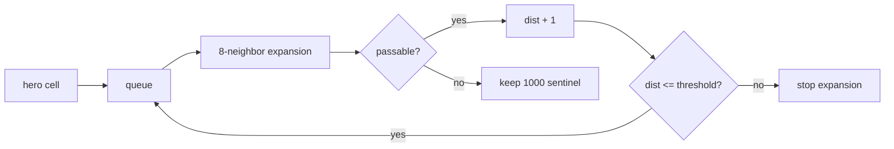
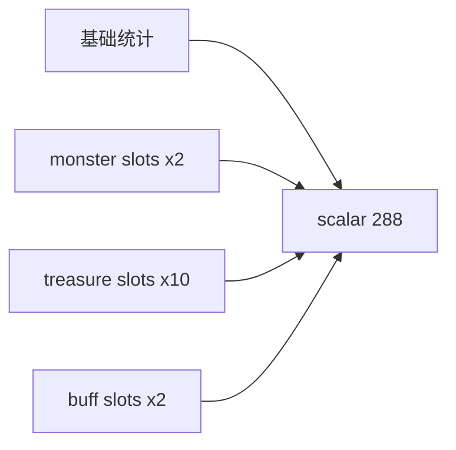

# 02 观测与全局记忆

当前 `obs` 是扁平向量，模型内部再切回图像、标量和 hidden state。

## Obs 布局



| 块 | 维度 | 说明 |
|---|---:|---|
| local | `7*21*21 = 3087` | 以英雄为中心的近场视野 |
| global | `6*32*32 = 6144` | 压缩后的全地图记忆与规划特征 |
| scalar | `288` | 计数、坐标、距离桶、one-hot 方向等 |
| h_in | `128` | Mamba 上一帧隐状态 |
| 总计 | `9647` | `Config.DIM_OF_OBSERVATION` |

## Local 通道



| 通道 | 名称 | 值域 | 语义 |
|---:|---|---|---|
| 0 | `passable` | 0/1 | 1 可通行，0 障碍/越界 |
| 1 | `bfs_from_hero` | 0-1 | 从英雄出发的 BFS 距离，阈值裁剪后归一化 |
| 2 | `hero_onehot` | 0/1 | 英雄中心格为 1 |
| 3 | `visible_monster` | 0/1 | 可见怪物位置 |
| 4 | `treasure_alive` | 0/1 | 已知且可拾取宝箱 |
| 5 | `buff_availability` | 0-1 | `1 - norm(buff_cd_remaining)`，可拾取 buff 为 1 |
| 6 | `unexplored_passable` | 0/1 | 本次之前未见过的可通行格 |

## Global 通道


全局 `passable` 初始默认全图可通行。每步把 `map_info(21x21)` 贴回 128x128 内部记忆后，覆盖已观测区域的通行状态；写入 obs 前再压缩到 32x32。

## 记忆更新



## BFS 规则



- 障碍和不可达格先填 `1000`。
- global BFS 阈值默认 `500`。
- local BFS 归一化阈值默认 `30`。
- `MONSTER_POS_BFS_LOSS_THRESHOLD = 64` 是保留配置；当前怪物位置辅助 loss 使用归一化坐标 SmoothL1，不再生成或存储 BFS 监督图。

## Scalar 结构

scalar 由三类信息拼接后补零/截断到 `288`：



方向字段使用 8 维 one-hot：环境方向 `1-8` 映射到 one-hot；方向 `0` 或无效时全 0，并用 `present/visible/status` 字段表达是否有效。

## Explore Direction Scalar Features

The scalar block keeps `SCALAR_DIM = 288` and uses six previously padded slots
for an exploration-frontier signal. This is an observation feature only; it does
not rewrite action probabilities and does not add an action-logit bias. The raw
features are multiplied by `EXPLORE_VECTOR_FEATURE_SCALE` before entering the
model so old checkpoints are not strongly perturbed by formerly zero padding
slots.

The preprocessor computes a reachable frontier from global memory:

```text
frontier = passable and not yet explored and adjacent to an explored cell
reachable = hero BFS distance is finite and within GLOBAL_BFS_THRESHOLD
active_frontier = frontier and reachable
```

If no strict frontier exists, reachable unexplored passable cells are used as a
fallback. The feature vector is:

| Feature | Raw Range | Meaning |
|---|---:|---|
| `explore_vec_x` | `[-1, 1]` | weighted direction toward reachable frontier in map-x axis |
| `explore_vec_z` | `[-1, 1]` | weighted direction toward reachable frontier in map-z axis |
| `explore_vec_norm` | `[0, 1]` | coherence and safety-scaled strength of the direction |
| `nearest_frontier_bfs_norm` | `[0, 1]` | normalized BFS distance to nearest active frontier |
| `frontier_count_norm` | `[0, 1]` | active frontier count normalized by config |
| `explore_safety_factor` | `[0, 1]` | lowers exploration pressure when monster BFS is dangerous |

The direction is computed from existing global BFS and memory maps, so no extra
full-map BFS is introduced.
