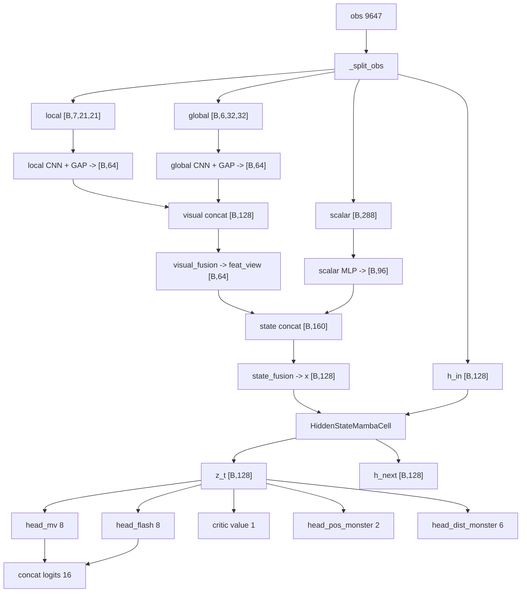
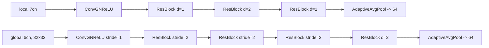
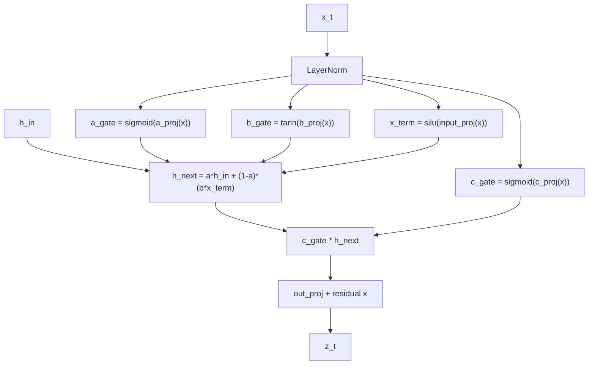
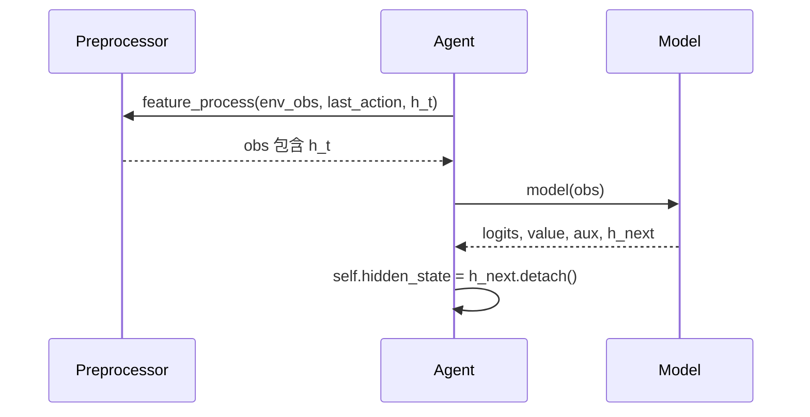

# 03 模型与真隐状态

模型路径：`code/agent_ppo/model/model.py`。

2026-04-25 update: learner training uses `Model.forward_sequence(obs_seq, seq_mask)` to batch CNN/scalar/action-prior computation over `[B*T]` frames and only loop the hidden-state Mamba cell over `T=48`. Actor inference still uses the single-step `Model.forward(obs)` path.

## Lightweight Two-stage Fusion

The model input contract is now `global 6x32x32`. `Preprocessor` still keeps 128x128 global memory internally, then compresses it to 32x32 before concatenating obs. CNN width is raised to `CONV_CHANNEL = 64`.

Fusion is split into two stages:

```text
local_feat  = local_encoder(local_obs)
global_feat = global_encoder(global_obs)
feat_view   = visual_fusion(concat(local_feat, global_feat))
scalar_feat = scalar_mlp(scalar_obs)
x_mamba     = state_fusion(concat(feat_view, scalar_feat))
z_t, h_next = mamba(x_mamba, h_in)
```

## 模型总图



## CNN 分支



全局图输入是压缩后的 `32x32`，三次 stride=2 后进入 dilation block，再做 GAP。

## 真隐状态 Mamba Cell

实现目标：

```text
h_t = A(x_t) * h_{t-1} + B(x_t) * x_t
z_t = C(x_t) * h_t
```

代码中用门控近似：



## Hidden State 传递



训练时每个 `SampleData` 是一个非重叠 48 步窗口，携带 `seq_id/seq_pos/seq_mask/seq_len`。learner 会按窗口顺序做最多 `MAMBA_TBPTT_LEN = 48` 步 unroll；窗口首帧使用采样时固化在 `obs` 里的 `h_in`，后续帧使用当前模型产生的 `h_next` 继续反传，padding 帧不参与 loss。

## 输出头

| Head | 输出 | 用途 |
|---|---:|---|
| `head_mv` | 8 | 移动方向 logits |
| `head_flash` | 8 | 闪现方向 logits |
| `critic_head` | 1 | PPO value |
| `head_pos_monster` | 2 | 最近可见怪物归一化 `(x,z)` |
| `head_dist_monster` | 6 | 怪物距离桶分类 |

`head_mv` 和 `head_flash` 拼接成 16 维 logits，再由 legal action mask 做 masked softmax。
