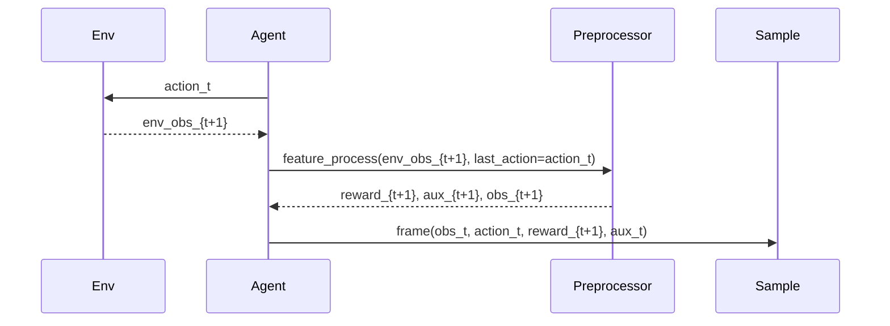

# 04 Reward, Training, And Auxiliary Loss

This page documents the current behavior of:

- `code/agent_ppo/feature/preprocessor.py`
- `code/agent_ppo/feature/definition.py`
- `code/agent_ppo/agent.py`
- `code/agent_ppo/algorithm/algorithm.py`

For exact constant values, use [07_config_snapshot.md](07_config_snapshot.md).

## Reward

The active shaped reward is a clipped sum of score, survival, exploration,
resource, safety, flash, anti-loop, stillness, and terminal components.

```mermaid
flowchart TD
    R["reward"] --> STEP["+0.04 base step survival"]
    R --> ALIVE["+0.03 alive-per-step survival"]
    R --> SCORE["+0.04 * positive score_delta"]
    R --> TR["+8.0 * treasure_delta"]
    R --> EX["+0.05 * new explored passable cells"]
    R --> GX["global exploration progress"]
    R --> EV["explore vector alignment"]
    R --> APP["frontier/resource approach"]
    R --> BUFF["buff pickup and maintain"]
    R --> SAFE["safe distance and escape"]
    R --> SCOUT["post-escape scout"]
    R --> TRAIL["trail / route safety"]
    R --> FLASH["danger-gated flash"]
    R --> SURV["survival milestones"]
    R --> LOOP["anti-loop shaping"]
    R --> STILL["still / invalid move penalties"]
    R --> NEAR["near-monster penalty"]
    R --> CAUGHT["caught terminal penalty"]
    R --> CLIP["clip [-20, 30]"]
```



| Component | Current Rule |
|---|---|
| Step survival | `REWARD_STEP = 0.04` plus `REWARD_SURVIVE_ALIVE_PER_STEP = 0.03` every live transition |
| Score delta | `REWARD_SCORE_DELTA = 0.04`, applied only to positive `env_info.total_score` increments |
| Treasure pickup | `REWARD_TREASURE = 8.0` |
| New explored cells | `REWARD_EXPLORE_PER_CELL = 0.05` |
| Explore vector alignment | previous observation's reachable-frontier vector gives `+0.04 * alignment` for true displacement along it, or `-0.02 * oppose` for moving against it |
| Frontier approach | `REWARD_EXPLORE_APPROACH = 0.08` when nearest unexplored BFS decreases |
| Global exploration progress | target is full-map coverage by `4 * 128 = 512` steps; lag is penalized more strongly, on-track/ahead progress is rewarded |
| Buff maintain | `REWARD_BUFF_MAINTAIN = 0.01` while buff is active |
| Buff pickup | `REWARD_BUFF_BEFORE_500 = 3.0`, `REWARD_BUFF_AFTER_500 = 10.0` |
| Monster BFS delta | gated by pressure: full at BFS `<=6`, decays to zero by BFS `12`; away from monster: `0.12 * clipped_delta`; toward monster: `0.18 * clipped_delta`, where negative delta is a penalty |
| No visible monster | `REWARD_NO_VISIBLE_MONSTER = 0.03` |
| Safe monster distance | starts at BFS `8`, capped at BFS `12`, coefficient `0.004` |
| Danger escape | crossing from `<=8` BFS to `>8` BFS gives `+0.4` |
| Flash success | previous monster BFS `<=6` and flash hides monster or improves BFS by at least `2`: `+3.0` |
| Flash fail / safe flash / flash on CD | `-0.5`, `-2.0`, `-0.5` |
| Treasure / buff approach | coefficients `0.04` and `0.04`, scaled by monster safety factor from `0.5` to `1.0` |
| Post-escape scout | for 64 steps after BFS `<=8`, reward moving away from the last danger point and penalize drifting back |
| Trail progress | reward moving at least 8 cells away from recent trail; penalize low-unique local loops |
| Route safety | reward increasing adjacent open exits; under BFS `<=12`, penalize losing exits or staying in low-exit cells |
| Survival milestones | `25/50/75/100/150/200/250/300/400/500 -> 1.5/2.5/3.5/5/7/9/11/14/18/25` |
| Still / move-still / consecutive still | `-0.04`, additional `-0.08`, and additional `-0.02 * count` capped at `-0.20` |
| Anti-loop close / near / progress | `-0.08`, `-0.03`, `+0.12` |
| Near monster | BFS `<6`: `-(6 - bfs) * 0.06` |
| Caught | `PENALTY_CAUGHT = -10.0` |
| Clip | `[-20.0, 30.0]` |

Episode-level reward debug metrics include `score_delta`, `survival_bonus`,
`global_explore_reward`, `global_explore_ratio`,
`global_explore_target_ratio`, `global_explore_gap`,
`explore_vector_reward`, `resource_approach_bonus`, `flash_reward`, and penalty
components.
`Preprocessor` also emits step-level `post_escape_scout_reward`,
`trail_reward`, `route_safety_reward`, and `anti_loop_reward`; those are not
currently aggregated by `EpisodeRunner` into final episode monitor output.

## Reward Timing

Each sample stores the state and action for time `t`, while the reward comes
from the next environment observation.



## Training Action Sampling

Actor training stores the model behavior distribution that generated the
rollout action in `SampleData.prob`. That distribution must use the same
policy basis as learner-side `pi_new`: model logits, including model-side action
priors, followed only by the legal action mask.

Runtime guard/filter helpers exist in `agent.py`, but they are not part of the
active training sampler. Re-enabling them for rollout without reproducing the
same transformation in `Algorithm._compute_loss()` would compare externally
rewritten `old_prob` against learner-side raw model `new_prob`, making
`ratio`, `approx_kl`, and `clip_frac` unreliable.

Therefore the active rollout sampling path is:

```text
model logits
-> legal masked softmax
-> TRAIN_SAMPLE_TOP_K = 16
-> TRAIN_SAMPLE_TEMPERATURE = 1.0
-> sample action
```

Because `TRAIN_SAMPLE_TOP_K = 16` over a 16-action space and
`TRAIN_SAMPLE_TEMPERATURE = 1.0`, the current rollout distribution is not
top-k truncated or temperature-sharpened. `SampleData.prob` stores the active
legal-masked model probability.

Deterministic `d_action` and platform `exploit()` use policy argmax by default.
External resource/frontier or flash/monster guards should stay disabled during
PPO training unless their required state is added to `SampleData` and learner
loss recomputes the same behavior distribution.

## PPO Loss

```text
total_loss =
    policy_loss
  + VF_COEF * value_loss
  + BETA_START * entropy_loss
  + AUX_MONSTER_POS_COEF * aux_pos_loss
  + AUX_MONSTER_DIST_COEF * aux_dist_loss
```

Current coefficients:

| Coefficient | Value |
|---|---:|
| `VF_COEF` | `0.5` |
| `BETA_START` | `0.02` |
| `AUX_MONSTER_POS_COEF` | `0.2` |
| `AUX_MONSTER_DIST_COEF` | `0.1` |
| `AUX_LOSS_VISIBLE_MONSTER_WEIGHT` | `5.0` |

`entropy_loss = -mean(H(pi_new))`, so the entropy term still encourages
exploration. The coefficient is intentionally conservative for initial-model
fine-tuning, where preserving the evaluated baseline policy matters more than
large policy movement.

Advantages are normalized over active, non-padding timesteps before policy loss.
Value loss uses clipped value targets with `VALUE_CLIP_PARAM = 2.0`.

## Auxiliary Losses

When a visible monster exists, `Preprocessor` stores the nearest visible monster
position and distance bucket:

| Field | Shape Per Window | Meaning |
|---|---:|---|
| `monster_pos_target` | `2 * 48` | normalized `(x, z)` target |
| `monster_pos_mask` | `48` | visible-monster mask |
| `monster_dist_target` | `48` | distance bucket `0..5` |
| `monster_dist_mask` | `48` | visible-monster mask |

`Algorithm` applies `AUX_LOSS_VISIBLE_MONSTER_WEIGHT = 5.0` to visible-monster
auxiliary samples to compensate for sparsity.

## SampleData Window Schema

Each replay item is a non-overlapping 48-step window. Padding timesteps are
masked out by `seq_mask`.

| Field | Shape |
|---|---:|
| `obs` | `9647 * 48` |
| `legal_action` | `16 * 48` |
| `act/reward/value/reward_sum/advantage/done` | `48` |
| `prob` | `16 * 48` |
| `monster_pos_target` | `2 * 48` |
| `monster_pos_mask/monster_dist_target/monster_dist_mask` | `48` |
| `seq_id` | `1` |
| `seq_pos` | `48` |
| `seq_mask` | `48` |
| `seq_len` | `1` |

The framework batch parameters live in `code/conf/configure_app.toml`, not in
`agent_ppo/conf/conf.py`. Current training uses off-policy framework mode with
FIFO replay and `SampleToInsertRatio`; the app layer keeps sequence windows and
behavior probabilities aligned for PPO training.
