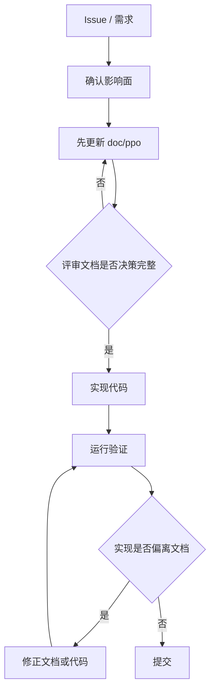
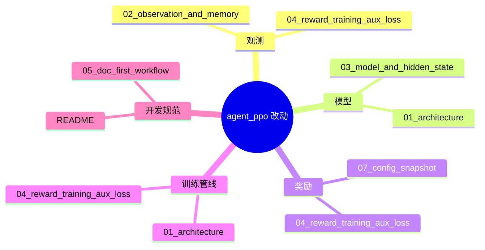
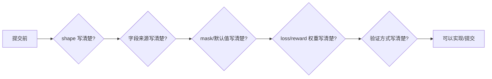

# 05 文档优先开发流程

后续 `agent_ppo` 开发默认文档优先。核心原则：先把决策写进 `doc/ppo`，再改代码；实现后把实际结果写回文档。

## 标准流程

## 改动类型与必须更新的文档

| 改动 | 先更新 |
|---|---|
| 新增/删除观测通道 | `02_observation_and_memory.md` |
| 改 `Config.DIM_OF_OBSERVATION` | `02_observation_and_memory.md`、`README.md` |
| 改 `code/agent_ppo/conf/conf.py` 中的 `Config` 默认值 | `07_config_snapshot.md`，并同步对应专题页 |
| 改模型 head 或 hidden state | `03_model_and_hidden_state.md` |
| 改 `SampleData` 字段 | `04_reward_training_aux_loss.md` |
| 改 reward 或 loss | `04_reward_training_aux_loss.md` |
| 改训练 batch、样本池或模型同步配置 | `04_reward_training_aux_loss.md`、`07_config_snapshot.md` |
| 跨模块重构 | `01_architecture.md` |

## 文档检查清单

提交前至少确认：

- 维度公式能直接算出最终长度。
- 每个新增字段都有来源、默认值和 mask 语义。
- reward/loss 的正负号和 clip 规则明确。
- Mermaid 图能描述主要数据流，不只写文字。
- 验证命令和已知阻塞要写在最终回复或文档里。

## 推荐开发顺序

```mermaid
gantt
    title agent_ppo 文档优先开发节奏
    dateFormat  X
    axisFormat  %s
    section 设计
    更新 doc/ppo        :0, 2
    确认 shape/loss     :2, 1
    section 实现
    改 Config/SampleData :3, 1
    改 Preprocessor     :4, 2
    改 Model/Algorithm  :6, 2
    section 验证
    shape smoke         :8, 1
    forward/backward    :9, 1
    train_test          :10, 1
```

## 例外情况

小修可以先改代码再补文档，但只限以下情况：

- 注释、日志、错别字。
- 不改变行为的内部变量重命名。
- 单行 bugfix，且不改变接口、shape、reward、loss。

只要涉及训练行为或样本格式，就不属于小修。
