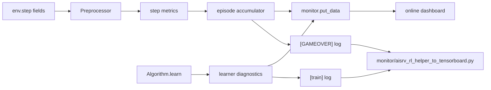

# 06 Monitoring

This page is the monitoring contract for `agent_ppo`. Update it whenever a
metric name, log field, dashboard panel, reward component, or offline parser
behavior changes.

## Data Flow



Main implementation points:

- Dashboard registration: `code/agent_ppo/conf/monitor_builder.py`
- Learner metrics: `code/agent_ppo/algorithm/algorithm.py`
- Episode aggregation: `code/agent_ppo/workflow/train_workflow.py`
- Offline TensorBoard conversion: `monitor/aisrv_rl_helper_to_tensorboard.py`

## Dashboard Groups

| Group | Metrics | Source |
|---|---|---|
| `algorithm` | `total_loss`, `policy_loss`, `value_loss`, `entropy_loss` | learner |
| `algorithm` | `aux_pos_loss`, `aux_dist_loss` | learner |
| `algorithm` | `approx_kl`, `clip_frac`, `grad_norm` | learner |
| `algorithm` | `advantage_mean`, `advantage_std` | learner, before normalization |
| `algorithm` | `seq_mean_len`, `seq_max_len`, `seq_active_max_len` | learner sequence batch |
| `episode` | `reward`, `episode_steps` | episode end |
| `[GAMEOVER] log / offline parser` | `sim_score` | episode end log only, not in `monitor_data` |
| `episode` | `caught_rate`, `post500_survival_rate` | episode end |
| `episode` | reward debug components listed below | episode end |
| `behavior` | `explore_cells`, `treasure_count`, `buff_count` | episode end |
| `behavior` | `global_explore_ratio`, `global_explore_target_ratio`, `global_explore_gap` | episode end |
| `behavior` | `flash_rate`, `flash_success_rate`, `still_rate` | episode end |
| `behavior` | `avg_min_monster_bfs`, `visible_monster_count` | episode end |
| `behavior` | `legal_action_count`, `legal_move_count`, `legal_flash_count` | episode end |
| `behavior` | `chosen_action_is_legal`, `move_action_rate`, `position_changed_rate`, `wall_or_still_after_move_rate` | episode end |
| `episode` | `reward_component_mean`, `reward_component_std`, `reward_component_var` | episode end |
| `episode` | `reward_positive_component_mean`, `reward_negative_component_mean` | episode end |
| `performance` | `feature_ms_*_mean`, `feature_ms_*_max` | episode end |

Episode-level reward debug components currently reported by `monitor_data`
include:

- `score_delta`
- `survival_bonus`
- `safety_bonus`
- `monster_bfs_reward`
- `explore_approach_bonus`
- `explore_vector_reward`
- `global_explore_reward`
- `resource_approach_bonus`
- `flash_reward`
- `penalty_near_monster`
- `penalty_still`
- `penalty_caught`

`Preprocessor` also emits step-level `post_escape_scout_reward`,
`trail_reward`, `route_safety_reward`, and `anti_loop_reward`; the current
`EpisodeRunner` does not aggregate those into final episode monitor output.

## Learner Formulas

`pi_old` is the actual behavior distribution stored in `SampleData.prob`.
Current training rollout uses the model-side action-prior logits followed by
legal masking. `TRAIN_SAMPLE_TOP_K = 16` and `TRAIN_SAMPLE_TEMPERATURE = 1.0`,
so the current 16-action rollout distribution is not top-k truncated or
temperature-sharpened.

`pi_new` is recomputed by the learner from the current model logits plus the
legal action mask. The ratio should therefore compare the same policy basis:
learner-side legal-masked model probability against actor-side legal-masked
model probability. If `approx_kl` is already high before `optimizer.step()`, the
likely causes are model-version staleness or an accidental actor/learner
distribution mismatch.

| Metric | Formula / Definition |
|---|---|
| `ratio_t` | `pi_new(a_t) / max(pi_old_behavior(a_t), eps)` |
| `policy_loss` | `mean(max(-ratio_t * A_t, -clip(ratio_t, 1-0.2, 1+0.2) * A_t))` |
| `value_loss` | clipped value loss with `VALUE_CLIP_PARAM = 2.0` |
| `entropy_loss` | negative entropy of learner-side masked `pi_new` |
| `total_loss` | `policy_loss + VF_COEF * value_loss + BETA_START * entropy_loss + AUX_MONSTER_POS_COEF * aux_pos_loss + AUX_MONSTER_DIST_COEF * aux_dist_loss` |
| `approx_kl` | mean old-vs-new log-prob gap on sampled actions |
| `clip_frac` | fraction of active timesteps where `abs(ratio_t - 1) > CLIP_PARAM` |
| `grad_norm` | global gradient norm before optimizer step |

Current PPO constants:

- `CLIP_PARAM = 0.2`
- `VALUE_CLIP_PARAM = 2.0`
- `VF_COEF = 0.5`
- `BETA_START = 0.02`
- `TARGET_KL = 0.01`
- `GRAD_CLIP_RANGE = 0.5`

## Sequence Metrics

Each replay item is a non-overlapping sequence window, currently
`MAMBA_TBPTT_LEN = 48`.

| Metric | Meaning |
|---|---|
| `seq_mean_len` | mean real, non-padding sequence length in the learner batch |
| `seq_max_len` | configured padded window length, expected to be `48` |
| `seq_active_max_len` | maximum active timestep index used for loss in the batch |

Healthy sequence training should keep `seq_max_len = 48`. `seq_mean_len` can be
below 48 when episodes are short, but it should not stay near 1 after the window
sampler is active.

## Feature Timing Metrics

`Preprocessor.feature_process()` emits per-step wall-clock timings in
milliseconds. The episode accumulator reports each field as `<name>_mean` and
`<name>_max`.

| Metric | Meaning |
|---|---|
| `feature_ms_total` | Full `feature_process()` time, including state update and metric packaging |
| `feature_ms_parse` | Observation dictionary parsing, hero position, monster and organ normalization |
| `feature_ms_map_update` | Local-map stitching, dynamic-map decay, organ counters, and score delta |
| `feature_ms_bfs` | Hero BFS distance map construction |
| `feature_ms_targets` | Monster selection, legal action, buff availability, and nearest-object BFS lookups |
| `feature_ms_tensor` | Local/global/scalar feature tensor and aux target construction |
| `feature_ms_concat` | Hidden-state copy and final feature vector concatenation |
| `feature_ms_reward` | Reward computation |
| `feature_ms_metrics` | Step monitor metric packaging |

Interpretation rule for acceleration work:

- If `feature_ms_bfs_mean / feature_ms_total_mean` dominates, optimize BFS first.
- If `feature_ms_tensor_mean` dominates, vectorize feature construction first.
- If all feature timings are small but learner still waits for samples, the bottleneck is outside preprocessing, usually env stepping, AISRV throughput, replay flow, or model inference.

## Log Format

Learner logs use one `[train]` line per reporting interval. The stable fields
include:

```text
[train] total_loss:<v> policy_loss:<v> value_loss:<v> entropy:<v> aux_pos:<v> aux_dist:<v> kl:<v> clip_frac:<v> grad_norm:<v> adv_mean:<v> adv_std:<v> seq_mean_len:<v> seq_max_len:<v> seq_active_max_len:<v>
```

Episode logs use `[GAMEOVER]` lines. They include base outcome fields, behavior
fields, reward debug fields, global exploration fields, and reward density
fields. Newer logs also include feature timing fields:

```text
[GAMEOVER] episode:<n> steps:<n> result:<SUCCESS|FAIL> sim_score:<v> total_reward:<v> explore_cells:<v> treasure_count:<v> buff_count:<v> flash_rate:<v> flash_success_rate:<v> still_rate:<v> avg_min_monster_bfs:<v> visible_monster_count:<v> legal_action_count:<v> legal_move_count:<v> legal_flash_count:<v> chosen_action_is_legal:<v> move_action_rate:<v> position_changed_rate:<v> wall_or_still_after_move_rate:<v> caught_rate:<v> post500_survival_rate:<v> score_delta:<v> survival_bonus:<v> global_explore_reward:<v> global_explore_ratio:<v> global_explore_target_ratio:<v> global_explore_gap:<v> reward_component_mean:<v> reward_component_std:<v> feature_ms_total_mean:<v> feature_ms_bfs_mean:<v> feature_ms_tensor_mean:<v>
```

Offline parsers must tolerate missing fields in older logs.

## Offline TensorBoard Conversion

Use the local converter for `aisrv_kaiwu_rl_helper_pid*_log_*.log` and
`learner_train_pid*_log_*.log` files:

```powershell
python monitor/aisrv_rl_helper_to_tensorboard.py --dry-run
python monitor/aisrv_rl_helper_to_tensorboard.py --clean
```

Default output:

```text
P:\Repos\GorgeChase\train_monitor\tensorboard
```

The script is not a live tailer. Re-run it after new training logs are written.
