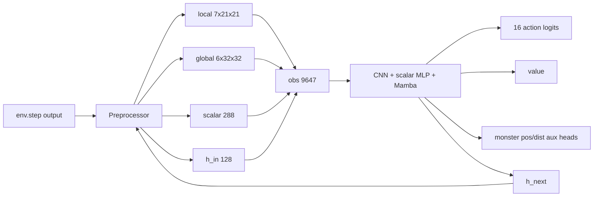

# PPO Documentation Index

This directory is the long-term design log for `agent_ppo`. For larger changes,
update the relevant document first, implement the code second, then bring the
document back in sync with the final behavior.

## Quick Index

| Document | Topic | Use it when |
|---|---|---|
| [01_architecture.md](01_architecture.md) | Overall architecture | You need the end-to-end PPO-Mamba data flow |
| [02_observation_and_memory.md](02_observation_and_memory.md) | Observation and global memory | You change features, BFS, maps, or scalar layout |
| [03_model_and_hidden_state.md](03_model_and_hidden_state.md) | Model and hidden state | You change CNN, Mamba hidden state, action/value heads, or sequence handling |
| [04_reward_training_aux_loss.md](04_reward_training_aux_loss.md) | Reward, PPO, auxiliary losses | You change reward, loss, sampling probability, or `SampleData` semantics |
| [05_doc_first_workflow.md](05_doc_first_workflow.md) | Doc-first workflow | You are planning a larger design change |
| [06_monitoring.md](06_monitoring.md) | Monitoring and metrics | You change dashboard groups, log fields, or offline parsing |
| [07_config_snapshot.md](07_config_snapshot.md) | Current config snapshot | You need the latest shape, reward, PPO, and action-selection constants |
| [08_no_curriculum_reward_alignment.md](08_no_curriculum_reward_alignment.md) | No curriculum and reward alignment | You review formal env distribution and reward ordering |
| [09_sequence_global32_smallscale.md](09_sequence_global32_smallscale.md) | 48-step sequence windows and near on-policy PPO | You change sequence sampling, replay, or small-scale on-policy boundaries |
| [10_survival_killshot_update.md](10_survival_killshot_update.md) | Survival killshot update | You review action priors, flash guard, exploit behavior, and short-run checks |
| [11_reward_density_monitoring.md](11_reward_density_monitoring.md) | Reward density monitoring | You inspect reward component density and variance |
| [12_post_train_preload.md](12_post_train_preload.md) | Post-train preload | You prepare or debug checkpoint preload from `agent_ppo/ckpt` |

## Archived Notes

| Document | Status |
|---|---|
| [ppo_refactor_v2_improvement.md](ppo_refactor_v2_improvement.md) | Historical proposal only; do not use its old constants as active config |

## Current Snapshot

Current important facts:

- `MAMBA_TBPTT_LEN = 48`
- `CONV_CHANNEL = 64`
- global map input is `6x32x32`
- BFS feature depth is capped by `GLOBAL_BFS_THRESHOLD = 160.0` and
  `LOCAL_BFS_THRESHOLD = 24.0`
- training rollout sampling uses `TRAIN_SAMPLE_TOP_K = 16` and
  `TRAIN_SAMPLE_TEMPERATURE = 1.0`
- runtime flash guard, near-monster move guard, and safe resource/frontier
  override are disabled during PPO training to keep actor `old_prob` and learner
  `new_prob` on the same model-distribution basis
- safe resource/frontier rollout boost is disabled with
  `RESOURCE_OVERRIDE_TRAIN_LOGIT = 0.0`
- monster pressure is close-range gated and fades out by BFS `12`
- scalar padding carries a reachable-frontier exploration direction feature;
  there is no exploration logits bias in the active policy
- PPO uses conservative initial-model fine-tuning:
  `INIT_LEARNING_RATE_START = 1e-5`, `BETA_START = 0.02`, and
  `TARGET_KL = 0.01`
- feature preprocessing timing is reported as `feature_ms_*_mean/max`
- `algorithm_on_policy_or_off_policy = "off-policy"` because native on-policy is
  rejected under `local_aisrv_workflow`
- FIFO replay uses `reverb_samples_per_insert = 1` with
  `reverb_error_buffer = 8`, so the rate limiter has only one learner-batch
  worth of slack
- preload requires exactly one `model.ckpt-*.pkl` under
  `code/agent_ppo/ckpt`; the next run should use the evaluated initial model,
  not the degraded candidate produced by the previous training round

## Doc-First Rule

Any change to these areas should update `doc/ppo`:

- observation layout, dimensions, and channel meanings;
- `SampleData` fields and replay serialization;
- model inputs, outputs, hidden-state handling, and action heads;
- reward, PPO loss, auxiliary loss, and action-sampling semantics;
- monitoring metrics, log fields, and offline parsers;
- training batch size, replay behavior, model preload, and checkpoint semantics;
- any `Config` value in `code/agent_ppo/conf/conf.py` that affects behavior.
